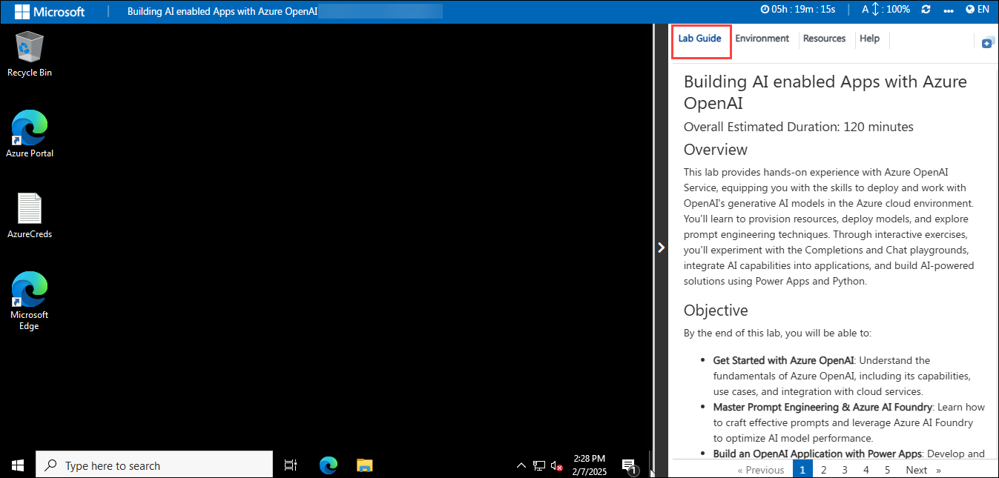
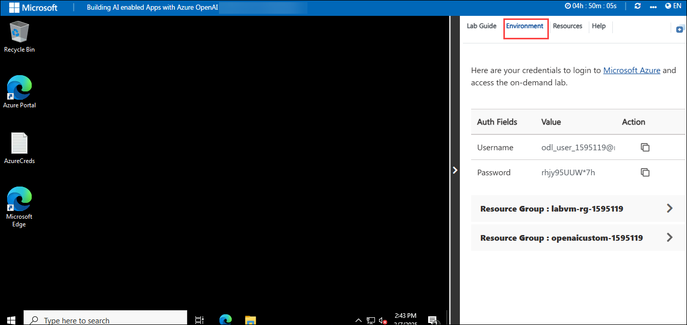
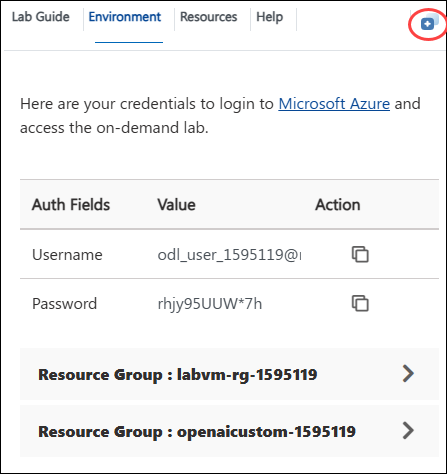
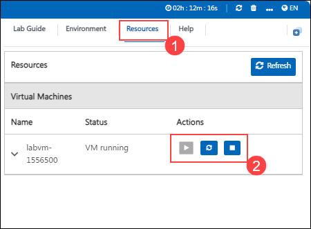

# Building AI enabled Apps with Azure OpenAI

### Overall Estimated Duration: 120 minutes

## Overview
This lab provides hands-on experience with Azure OpenAI Service, equipping you with the skills to deploy and work with OpenAI’s generative AI models in the Azure cloud environment. You’ll learn to provision resources, deploy models, and explore prompt engineering techniques. Through interactive exercises, you’ll experiment with the Completions and Chat playgrounds, integrate AI capabilities into applications, and build AI-powered solutions using Power Apps and Python.

## Objective
By the end of this lab, you will be able to:  

- **Get Started with Azure OpenAI**: Understand the fundamentals of Azure OpenAI, including its capabilities, use cases, and integration with cloud services.  
- **Master Prompt Engineering & Azure AI Foundry**: Learn how to craft effective prompts and leverage Azure AI Foundry to optimize AI model performance.  
- **Build an OpenAI Application with Power Apps**: Develop and integrate AI-powered applications using Power Apps to automate workflows and enhance user interactions.  
- **Build an OpenAI Application with Python**: Implement AI-driven solutions using Python, leveraging Azure OpenAI's APIs for various natural language processing tasks.  

## Pre-Requisites
- **Basic Knowledge of Azure and AI Services**: Familiarity with **Azure OpenAI Service**, its capabilities, and cloud-based AI integration.  
- **Understanding of Prompt Engineering**: Basic knowledge of crafting effective prompts for AI models and using **Azure AI Foundry**.  
- **Familiarity with Software Development**: Experience with programming concepts, particularly in **Python**, and working with APIs.  
- **Experience with Low-Code Platforms** (Optional): Basic understanding of **Power Apps** for building AI-driven applications.  
- **Basic Knowledge of Cloud & Security**: Understanding cloud deployment, API authentication, and security best practices in AI applications.  

## Getting Started with Lab

## Accessing Your Lab Environment
 
Once you're ready to dive in, your virtual machine and lab guide will be right at your fingertips within your web browser.

  
 
## Exploring Your Lab Resources
 
To get a better understanding of your lab resources and credentials, navigate to the **Environment** tab.
 
  
 
## Utilizing the Split Window Feature
 
For convenience, you can open the lab guide in a separate window by selecting the **Split Window** button from the Top right corner.
 
  

## Managing Your Virtual Machine
 
Feel free to start, stop, or restart your virtual machine as needed from the **Resources** tab. Your experience is in your hands!

  

## Lab Guide Zoom In/Zoom Out
 
1. To adjust the zoom level for the environment page, click the **A↕ : 100%** icon located next to the timer in the lab environment.

     

## Login to Azure Portal

1. In the JumpVM, click on the Azure portal shortcut of the Microsoft Edge browser from the desktop.

   

1. In the Welcome to Microsoft Edge page, select **Start without your data**, and on the help for importing Google browsing data page select **Continue without this data** button and proceed to select **Confirm and start browsing** on the next page.
   
1. On the **Sign in to Microsoft Azure** tab you will see a login screen, enter the following email/username and then click on **Next**. 
   * Email/Username: <inject key="AzureAdUserEmail"></inject>
   
     
     
1. Now enter the following password and click on **Sign in**.
   * Password: <inject key="AzureAdUserPassword"></inject>
   
     
     
1. If you see the pop-up **Stay Signed in?**, click No

1. If you see the pop-up **You have free Azure Advisor recommendations!**, close the window to continue the lab.

1. If a **Welcome to Microsoft Azure** popup window appears, click **Cancel** to skip the tour.
   
1. Now you will see the Azure Portal Dashboard, click on **Resource groups** from the Navigate panel to see the resource groups.

    
   
1. Confirm you have resource groups present as shown in the below screenshot. The last six digits in the resource group name are unique for every user.

    
   
## Support Contact
The CloudLabs support team is available 24/7, 365 days a year, via email and live chat to ensure seamless assistance at any time. We offer dedicated support channels tailored specifically for both learners and instructors, ensuring that all your needs are promptly and efficiently addressed.
 
Learner Support Contacts:
 
- Email Support: cloudlabs-support@spektrasystems.com
- Live Chat Support: https://cloudlabs.ai/labs-support
 
### Happy learning !
