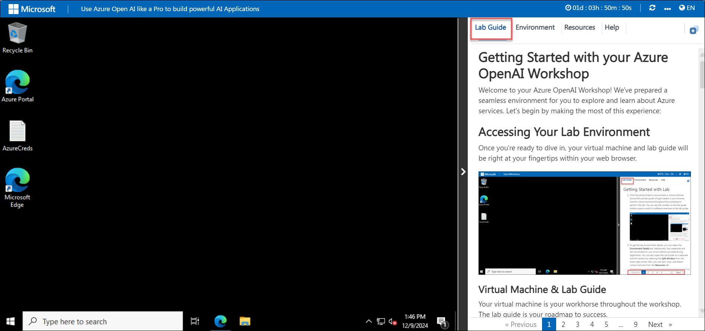
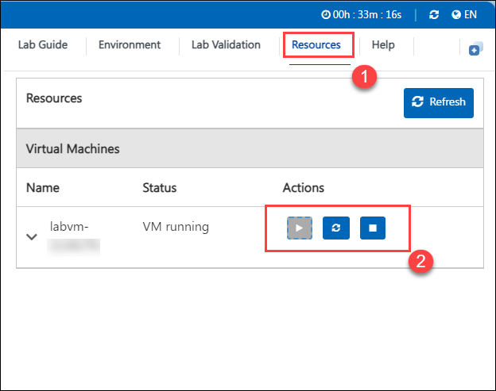
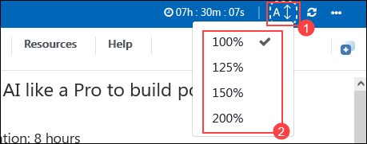
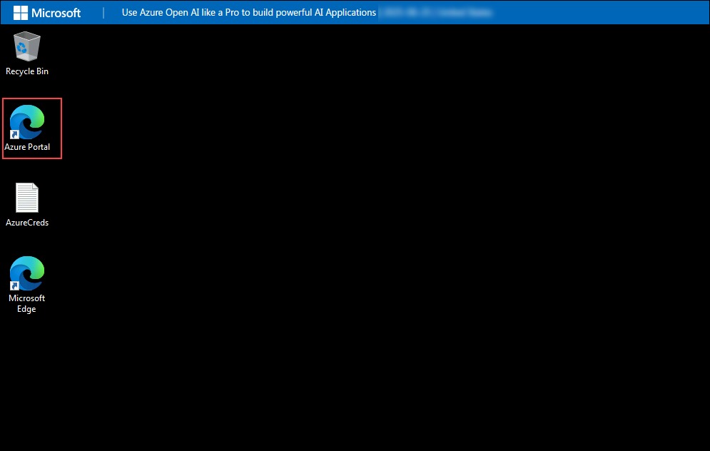
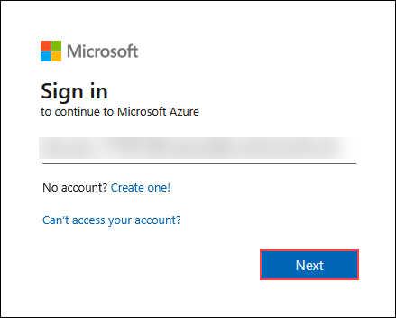
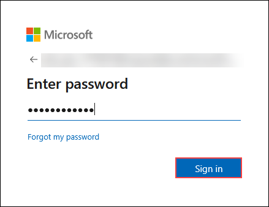
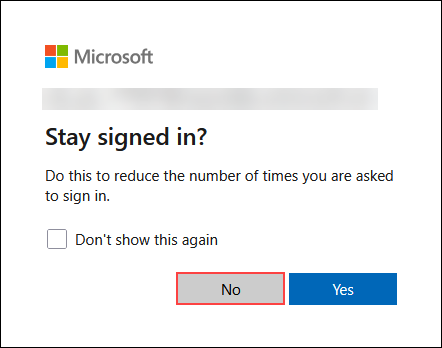
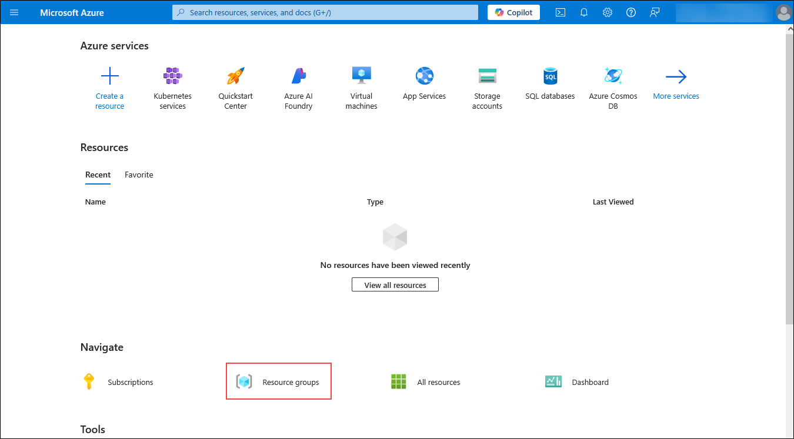

# Use Azure Open AI like a Pro to build powerful AI Applications

### Overall Estimated Duration: 8 hours

## Overview

These hands-on lab provide comprehensive training on integrating OpenAI capabilities into various applications and environments. They cover building pipelines in Azure Synapse for batch data processing and intelligent operations, creating applications with Power Apps and Python that leverage OpenAI's APIs for tasks like natural language processing and data analysis, and exploring advanced topics such as prompt engineering and model fine-tuning using Azure OpenAI Studio. The read-only sections offer theoretical insights into advanced concepts, fine-tuning techniques, hyperparameters in Azure OpenAI Service, and a glossary for understanding key terms and concepts. Together, these labs aim to equip participants with practical skills and theoretical knowledge necessary to effectively utilize OpenAI technologies across different platforms and applications.

## Objective

This lab is designed to equip participants with hands-on experience in using Azure OpenAI to build powerful AI applications. By completing this lab, participants will learn to:

1. **Build an Open AI Pipeline to Ingest Batch Data, Perform Intelligent Operations, and Analyze in Synapse:** Develop a pipeline to integrate OpenAI for batch data ingestion, intelligent operations, and analysis within Azure Synapse. Participants will create a robust pipeline for processing and analyzing batch data with OpenAI capabilities integrated into Azure Synapse.
   
1. **Build an Open AI application with Power App:** Create an application using Power Apps that integrates OpenAI capabilities for tasks like natural language understanding or data processing. Participants will develop a functional business application using OpenAI features in Microsoft Power Apps, enhancing user interaction and automation.
   
1. **Build an Open AI application with Python:** Build applications using Python to leverage OpenAI's APIs for tasks such as language generation, sentiment analysis, or recommendation systems. Participants will construct a custom application leveraging Python and OpenAI APIs for advanced text generation and analysis.

1. **Introduction to Prompt Engineering & Azure OpenAI Studio:** Learn techniques for crafting effective prompts and utilize Azure OpenAI Studio for developing and deploying AI models. Participants will learn how to optimize AI model responses through effective prompt engineering and utilize Azure OpenAI Studio for model development.

## Explore

Explore and understand the read-only exercises to gain additional knowledge on Azure OpenAI concepts:

1. **Advanced Concepts (Read-Only):** Explore advanced theoretical knowledge and practical applications related to OpenAI technologies and their implementations. Participants will gain theoretical insights into advanced AI concepts, enriching their understanding of AI technologies.

1. **Fine Tuning (Read-Only):** Understand and practice fine-tuning OpenAI models to improve performance on specific tasks or datasets. Participants will understand the principles and techniques of fine-tuning AI models to improve performance for specific tasks.

1. **Basic Overview of Azure OpenAI Service Hyperparameters (Read-Only):** Gain foundational understanding of hyperparameters in Azure OpenAI Service and their impact on model training and performance. Participants will acquire knowledge about hyperparameters in Azure OpenAI Service, crucial for model configuration and optimization.

1. **Glossary (Read-Only):** Access definitions and explanations of key terms and concepts essential for understanding OpenAI and Azure OpenAI Service. Participants will familiarize themselves with key AI and Azure terminologies, enhancing their comprehension of related concepts and technologies.

## Prerequisites

Participants should have: 

- Proficiency in Python programming language, including libraries like Pandas for data manipulation and Flask for web application development.
- Experience with Microsoft Power Apps or similar low-code platforms for application development and integrating APIs.
- Basic understanding of machine learning concepts such as model training, deployment workflows, and RESTful APIs.
- Understanding of AI concepts such as natural language processing, model fine-tuning, and hyperparameter optimization.

## Architecture

These labs utilize Azure Synapse for data integration and analytics pipelines, Power Apps for intuitive OpenAI application development, Python for AI-driven solutions using OpenAI APIs, and Azure OpenAI Studio for model development with prompt engineering. Read-only modules cover advanced AI concepts, fine-tuning, hyperparameters, and a glossary, providing foundational knowledge. Participants gain practical skills in leveraging OpenAI effectively across various applications within Azure environments.

## Architecture Diagram

## Explanation of Components

The architecture for this lab involves several key components:

- **Storage Account:** Provides a secure and scalable cloud storage solution for storing data objects, such as files, blobs, and unstructured data.
- **Synapse Workspace:** Azure Synapse Analytics is an integrated analytics service that combines big data and data warehousing capabilities. The workspace allows for seamless collaboration between data engineers, data scientists, and analysts.
- **Azure Open AI Service:** Provides access to OpenAI's powerful AI models through Azure, enabling integration into applications for natural language processing, text generation, and more.
- **Microsoft Power Apps:** A low-code platform that allows users to build custom business applications without extensive coding knowledge.
- **Prompt Engineering:** Involves crafting specific prompts or queries to elicit desired responses from AI models, influencing the output and behavior of AI systems.

## Getting started with the lab
 
Welcome to your Use Azure Open AI like a Pro to build powerful AI Applications Workshop! We've prepared a seamless environment for you to explore and learn about Azure services. Let's begin by making the most of this experience:
 
## Accessing Your Lab Environment
 
Once you're ready to dive in, your virtual machine and lab guide will be right at your fingertips within your web browser.
 
   

### Virtual Machine & Lab Guide
 
Your virtual machine is your workhorse throughout the workshop. The lab guide is your roadmap to success.
 
## Exploring Your Lab Resources
 
To get a better understanding of your lab resources and credentials, navigate to the **Environment** tab.
 
   .png)
 
## Utilizing the Split Window Feature
 
For convenience, you can open the lab guide in a separate window by selecting the **Split Window** button from the Top right corner.
 
   
 
## Managing Your Virtual Machine
 
Feel free to start, stop, or restart your virtual machine as needed from the **Resources** tab. Your experience is in your hands!
 
  

## Lab Guide Zoom In/Zoom Out
 
To adjust the zoom level for the environment page, click the **A↕ : 100%** icon located next to the timer in the lab environment.

   

## Login to Azure Portal

1. In the JumpVM, click on the Azure portal shortcut of the Microsoft Edge browser from the desktop.

   

1. In the Welcome to Microsoft Edge page, select **Start without your data**, and on the help for importing Google browsing data page select **Continue without this data** button and proceed to select **Confirm and start browsing** on the next page.
   
1. On the **Sign in to Microsoft Azure** tab, you will see a login screen. Enter the following email/username and then click on **Next**. 
   * Email/Username: <inject key="AzureAdUserEmail"></inject>
   
     
     
1. Now enter the following password and click on **Sign in**.
   * Password: <inject key="AzureAdUserPassword"></inject>
   
     
     
1. If you see the pop-up **Stay Signed in?**, click **No**

   

1. If you see the pop-up **You have free Azure Advisor recommendations!**, close the window to continue the lab.

1. If a **Welcome to Microsoft Azure** popup window appears, click **Cancel** to skip the tour.

   
   
1. Now you will see the Azure Portal Dashboard, click on **Resource groups** from the Navigate panel to see the resource groups.

    
   
1. Confirm you have resource groups present as shown in the screenshot below. The last six digits in the resource group name are unique for every user.

    

This hands-on lab aims to empower participants in leveraging OpenAI technologies within Azure environments, spanning data ingestion, application development, prompt engineering, model optimization, and theoretical AI concepts for comprehensive learning and application.

## Support Contact
 
The CloudLabs support team is available 24/7, 365 days a year, via email and live chat to ensure seamless assistance at any time. We offer dedicated support channels tailored specifically for both learners and instructors, ensuring that all your needs are promptly and efficiently addressed.

Learner Support Contacts:
- Email Support: cloudlabs-support@spektrasystems.com
- Live Chat Support: https://cloudlabs.ai/labs-support

Now, click on **Next** from the lower right corner to move on to the next page.

### Happy Learning!!
