# OpenAI Workshop

## Exercise 1: Build an Open AI Pipeline to Ingest Batch Data, Perform Intelligent Operations, and Analyze in Synapse

#### Estimated Duration: 120 minutes

This lab aims to demonstrate how to integrate OpenAI capabilities into Azure Synapse Analytics for processing batch data, performing intelligent operations like natural language processing or predictive analytics, and analyzing the results efficiently within the Synapse environment.

### Lab Objectives

You will be able to complete the following tasks:

- Task 1: Ingest Data to Storage account
- Task 2: Set up Synapse Workspace
- Task 3: Query Results in Our SQL Table

### Task 1: Ingest Data to Storage account

#### A. Launch Azure Cloud Shell

1. In the [Azure portal](https://portal.azure.com?azure-portal=true), select the **[>_]** (*Cloud Shell*) button at the top of the page to the right of the search box. A Cloud Shell pane will open at the bottom of the portal.

    

2. The first time you open the Cloud Shell, you may be prompted to choose the type of shell you want to use (*Bash* or *PowerShell*). Select **Bash**. If you don't see this option, skip the step.

3. Within the Getting Started pane, select **Mount storage account (1)**, select your **Storage account subscription (2)** from the dropdown and click **Apply (3)**.

   .png)

4. Within the **Mount storage account** pane, select **Select existing storage account (1)** and click **Next (2)**.

   .png)

5. Within the **Advanced settings** pane, enter the following details:

    - **Subscription**: Default- Choose the only existing subscription assigned for this lab **(1)**.
    
    - **Resource group**: Select **Use existing** **(2)**

      - openai-<inject key="DeploymentID" enableCopy="false"></inject>
    
    - **Storage account**: Select **Use existing** **(3)**

      - openaistorage<inject key="DeploymentID" enableCopy="false"></inject>
    
    - **File share**: Create a new file share **(4)**

      .png)

6. Enter the file share name as **blob (1)**, select **OK**, and click on **Select (2)**.

    .png)

7.  Once the storage account is created, you will be prompted with the Bash window, as shown in the screenshot below.
    
    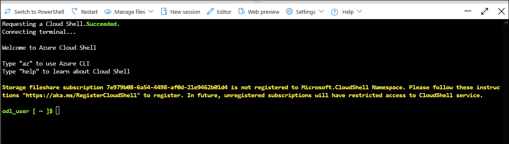

    > **Note**: Please disregard the warning `the storage file share subscription ID is not registered to Microsoft.CloudShell Namespace` and proceed with the next task.

#### B. Upload files to a storage account:

1. Run the following commands in the cloud shell to download and install Miniconda.

     ```bash 
     wget https://repo.anaconda.com/miniconda/Miniconda3-py39_23.1.0-1-Linux-x86_64.sh 
     ```

     ```bash 
     sh Miniconda3-py39_23.1.0-1-Linux-x86_64.sh 
     ```
    
    > **Note:** The following commands are issued in Bash; please ensure you are using **Bash** in the Cloud Shell.

1. Press `Enter` to continue with the installation process.
    
      > **Note:** Press the down arrow key to read or skip the license agreement.

      

1. Type **yes** and hit **enter** to accept the agreement, and then hit enter to install on the default path.

   

1. Type **yes** and hit **enter** to initialize the conda environment.

    

1. Run the following command to store the miniconda installed path to the variable.

    ```bash 
    export PATH=~/miniconda3/bin:$PATH
    ```
1. Run the below commands one by one to create and activate the conda environment in Cloudshell.

    ```bash 
    git clone https://github.com/CloudLabsAI-Azure/openaifilesworkshop.git
    cd openaifilesworkshop/scenarios/openai_batch_pipeline/document_generation
    conda create -n document-creation
    conda activate document-creation
    pip install --upgrade pip
    pip install -r reqs.txt
    ```
    > **Note**: If you encounter the "Conda: command not found" error, close your current CloudShell session, start a new bash session, and try running the commands from step 6 again.
    
1. Type **y** and hit Enter to proceed.

1. In the [Azure portal](https://portal.azure.com), navigate to your Storage Account with the suffix `functions` resource by selecting the **openai-<inject key="DeploymentID" enableCopy="false"/>** resource group and selecting the Storage Account from the list of resources.

    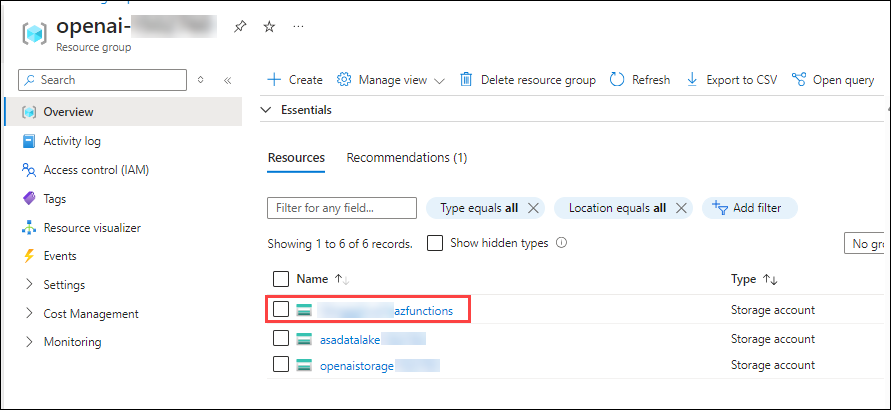
    
1. Switch to the **Access keys (1)** blade and select **Show (2)**, which is next to the Connection String value. Select the copy button for the first **connection string (3)**. Paste the value into a text editor, such as Notepad.exe, for later reference.

   

1. Go back to the cloud shell bash session and run the below command to upload the JSON files to the storage account by replacing the **CONNECTION_STRING** you copied in the previous step. This will take a few minutes to complete.

    ```bash 
    python upload_docs.py --conn_string "<CONNECTION_STRING>"
    ```

   

   > **Note**: Execute "cd OpenAIWorkshop scenarios/openai_batch_pipeline/document_generation" if you are not inside OpenAIWorkshop/scenarios/openai_batch_pipeline/document_generation directory.
   
1. Once you have successfully uploaded the JSON files to the storage account, navigate to **Containers (1)**, click on **workshop-data (2)**, and select the **cleansed_documents (3)** folder and verify that the files have been uploaded.
   
   

   

> **Congratulations** on completing the task! Now, it's time to validate it. Here are the steps:
> - If you receive a success message, you can proceed to the next task.
> - If not, carefully read the error message and retry the step, following the instructions in the lab guide. 
> - If you need any assistance, please contact us at cloudlabs-support@spektrasystems.com. We are available 24/7 to help you out.

<validation step="00e4628c-ed91-4b2a-a3ad-f4501680ab8e" />

### Task 2: Set up Synapse Workspace

#### **A. Set up Synapse Workspace**

1. In Azure portal, search for **Synapse** and select **Azure Synapse Analytics**.

   .png)

2. On the **Azure Synapse Analytics** page, Click on **+ Create**.
3. You will be navigated to the **Create Synapse Analytics** page, where you will be configuring the Synapse workspace.
4. On the Basics tab, provide the following details :

   - **Subscription:** Use **Existing Subscription(1)**.
   - **Resource Group:** Use **openai-<inject key="DeploymentID" enableCopy="false"></inject>(2)**
   - **Workspace name:** **synapseworkspace<inject key="DeploymentID" enableCopy="false"></inject>(3)**
   - **Region:** Select Default region(4)
   - **Select Data Lake Storage Gen2:** Select **From Subscription(5)**
   - **Account name:** **asadatalake<inject key="DeploymentID" enableCopy="false"></inject>(6)**
   - **File system name:** **defaultfs(7)**
   - Click on **Next : Security>(8)**

     .png)

5. On the **Security** tab, ensure that the Authentication method is set to **Use both local and Microsoft Entra ID authentication** and click on **Next: Networking**

   .png)

6. On the networking tab, make sure Managed virtual network is **Disable(1)** and **Allow connections from all IP addresses(2)** is checked, then click on **Review + create** and **Create** to deploy the resource.

   .png)
   
7. Once the resource is deployed, click on **Go to resource group**

   .png)

8. Navigate to the synapse workspace which you have created, on the **Overview** page, click on **Open** under Open Synapse Studio to navigate to Azure Synapse Studio.
   
   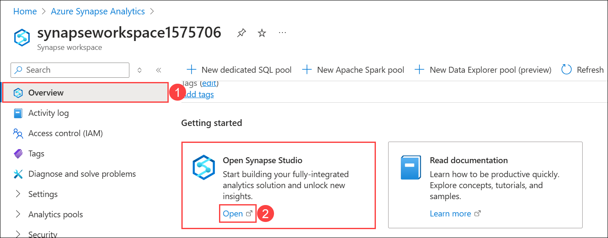

9. In the Azure Synapse Studio, navigate to **Manage > SQL pools** and then click on **+New**.

   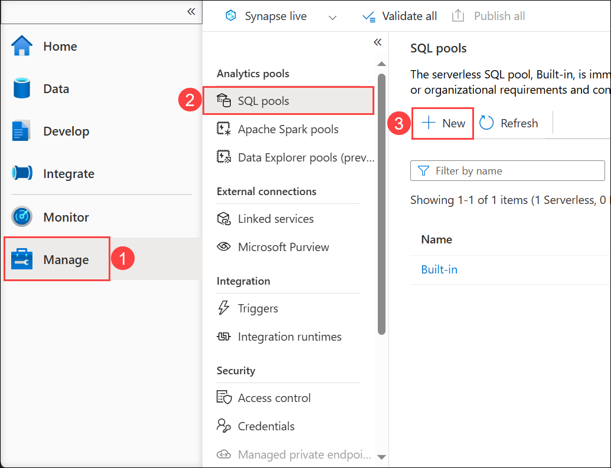

10. On the Basics tab of the New dedicated SQL pool, provide the following details:

    - **Dedicated SQL pool name:** **openaisql01 (1)**

    - **Performance level:** Reduce it to **DW100c (2)**

    - Click on **Review + create (3)**
   
      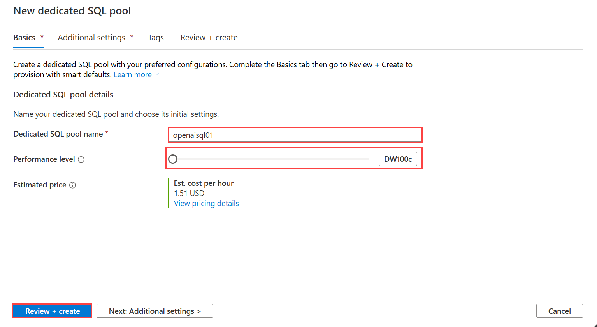
      
12. On **Review + create** page, click on **Create** and wait for the deployment to complete.

    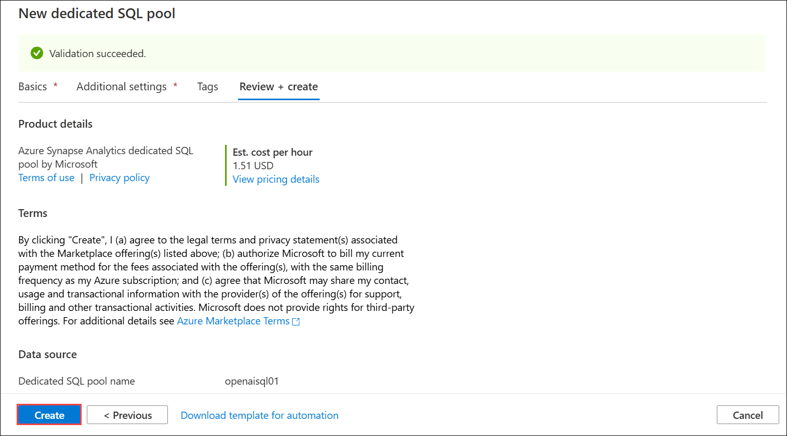

13. Now navigate back to Azure portal, **synapseworkspace<inject key="DeploymentID" enableCopy="false"></inject>**, select **Apache Spark pools (1)** from left pane under Analytics pools and click on **+ New (2)**.

    .png)  

14. On the New Apache Spark pool page, provide the following details and click on **Review + create (6)**, then **Create** on the Review + Create tab to create the Apache Spark pool.

    - **Apache Spark pool name:** **openaisparkpool (1)**

    - **Isolated Compute:** **Disabled (2)**

    - **Node size:** **Small(4vCores/32GB) (3)**

    - **Autoscale:** **Disabled (4)**

    - **Number of nodes:** **3 (5)**

      .png)
   
#### **B. Create Target SQL Table**

1. In the [Azure portal](https://portal.azure.com), navigate to **synapseworkspace<inject key="DeploymentID" enableCopy="false"/>** synapse workspace from **openai-<inject key="DeploymentID" enableCopy="false"/>** resource group. From the **Overview** tab, click on **Open** to launch the Synapse workspace.

      .png)

1. Click into the **Develop (1)** section of the Synapse Studio, click the **+ (2)** sign in the top left, and select **SQL script (3)**. This will open a new window with a SQL script editor. 

      

1. Copy and paste the following script into the editor **(1)**, then change the **Connect to** value by selecting **openaisql01(2)** from the drop-down, and for **Use database**, ensure that **openaisql01(3)** is selected, and click the **Run (4)** button in the top-left corner, as shown in the picture below. Finish this step by pressing **Publish all (5)** just above the **Run** button to publish our work thus far.

    ```SQL
    CREATE TABLE [dbo].[cs_detail]
    (
    interaction_summary varchar(8000),
    sentiment varchar(500),
    topic varchar(500),
    product varchar(500),
    filename varchar(500)
    )
    ```
    
      
    
1. Next, click on **Publish** to publish the SQL script.

      

#### **C. Create Source and Target Linked Services**

We'll next need to create two linked services: one for our source (the JSON files in the Data Lake) and another for the Synapse SQL Database that houses the table we created in the previous step.

1. Click back into the **Manage (1)** section of the Synapse Studio and click the **Linked services (2)** option under the **External connections** section. Then click **+ New (3)** in the top-left.

      
   
1. Start by creating the linked services for the source of our data, the JSON files housed in the ADLS Gen2 storage we created with our initial template. In the search bar that opens after you click New, search for **blob (1)**, select **Azure Blob Storage (2)** as depicted below, and click on **Continue (3)**.

      

1. Provide the name of your linked service as **openailinkedservice (1)**. Change the **Authentication Type** to **Account Key (2)**. Next, select the **subscription (3)** you are working with and finally select the storage account with **functions (4)** as suffix that you created in the starter template and uploaded the JSON files to. Then click **Test Connection (5)**. After the connection is successful, click the blue **Create (6)** button in the bottom left corner of the New Linked Service window.

      

1. Click **+ New** in the top-left. Search for **Synapse (1)**, select **Azure Synapse Analytics (2)**, and click on **Continue (3)**.

      

1. In the *New linked service* window that opens, fill in a name for your target linked service as **synapselinkedservice** **(1)**. Select **1.0 (2)** for the version. Select the **Azure subscription (3)** for which you have been working. Select the **synapseworkspace<inject key="DeploymentID" enableCopy="false"/> (4)** for **Server name** and **openaisql01 (5)** as the **Database name**. Be certain to change the **Authentication type** to **System-assigned managed identity (6)**, then scroll down and click on **Test connection (7)** and click **Create (8)**.

      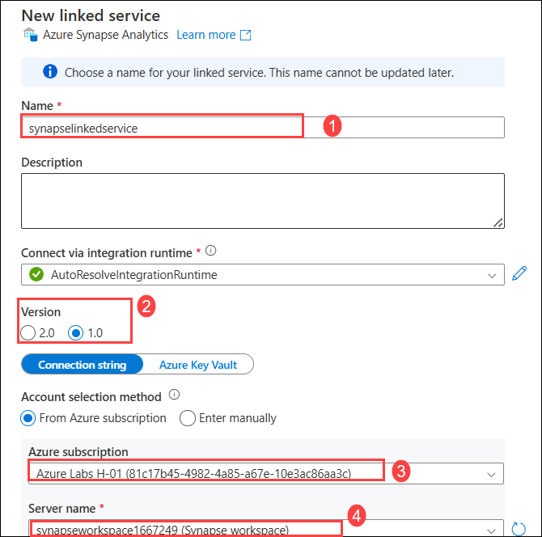

      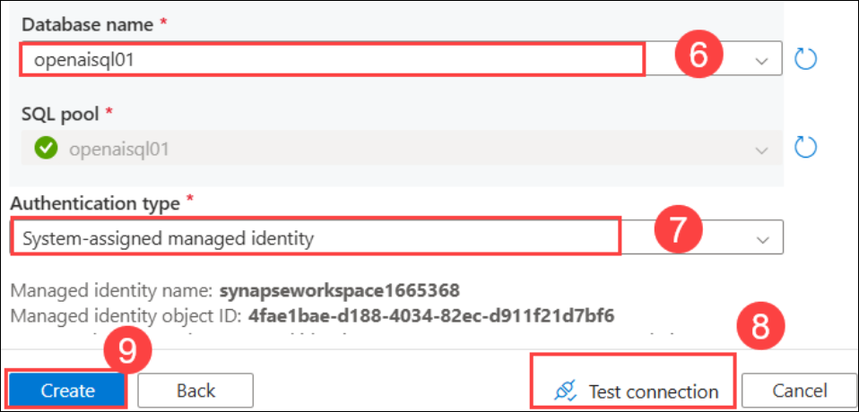

1. Once you have created the two linked services, be certain to press the **Publish all** button at the top to publish your work. Finalize the creation of the linked services and click **Publish**.

      
   
#### **D. Create Synapse Data Flow**

While still within the Synapse Studio, we will now need to create a **Data flow** to ingest our JSON data and write it to our SQL database. For this workshop, this will be a very simple data flow that ingests the data, renames some columns, and writes it back out to the target table.

1. First, we'll want to go back to the **Develop (1)** tab, select **+ (2)**, and then **Data flow (3)**.

      
   
1. Once the data flow editor opens, click **Add Source**. A new window will open at the bottom of the screen. Select **+ New** on the **Dataset** row while leaving the other options as default.

      

1. A new window should open on the right side of your screen. Next, search for **Azure Blob Storage (1)**, select **Azure Blob Storage (2)**, and then click on **Continue (3)**.
   
      

1. Next, select the **JSON (1)** option as our incoming data is in JSON format and click **Continue (2)**.

      

1. Select the Linked Service with the name **openailinkedservice (1)** we just set up in the steps above. You will need to select the proper **File path** to select the directory where our JSON files are stored. It should be something to the effect of **workshop-data / cleansed_documents (2)**. Click on the **OK** button to close the window.

      
   
1. Next, we'll need to move to the **Source options (1)** panel and drop down the **JSON settings (2)** options. We need to change the **Document form** option to the **Array of documents (3)** setting. This allows our flow to read each JSON file as a separate entry into our database.

         

1. Enable the toggle **data flow debug** session located at the top menu bar adjacent to the validate button, and click on **OK** on the *Turn on data flow debug* pop-up window.

      >**Note:** It will take a minute or two for the **data flow debug** session to get enabled.

1. Now head to the **Data preview** tab and run a preview to check your work thus far.
    
      
      
      >**Note**: Click the collapse button in the left tab to clearly view the data preview option, making the preview easier to see.
      
      >**Note**: If you're unable to view data under the Data Preview tab, please click on the Refresh button repeatedly until the data appears.
   
1. Next, we can add in our **Select** tile and do our minor alterations before writing the data out to the Synapse SQL table. To begin, click the small **+ (1)** sign next to our ingestion tile and choose the **Select (2)** option.

      

1. We can leave all the settings as defaults. Next, we'll add in our **Sink** tile. This is the step that will write our data out to our Synapse SQL database. Click on the small **+ (1)** sign next to our **Select** tile. Scroll all the way to the bottom of the options menu and select the **Sink (2)** option.

      

1. Once the **Sink (1)** tile opens, choose **Inline (2)** for the *Sink type*. Then select **Azure Synapse Analytics (3)** for the *Inline dataset type*, and for the **Linked service**, select **synapselinkedservice (4)**, which was created in the previous step. Ensure to run **Test connection (5)** for the linked service.

      

      > **Note**: If the test connection takes more than 3–4 minutes, follow the steps below.

      - Click on **Edit**.

               

      - In the Edit linked service window that opens, select the Azure selection method as **From Azure subscription** **(1)**. Select the **Azure subscription (2)** for which you have been working. Select the **synapseworkspace<inject key="DeploymentID" enableCopy="false"/> (3)** for **Server name** and **openaisql (4)** as the **Database name**, and then click on **Test connection (5)** and click **Save (6)**.

           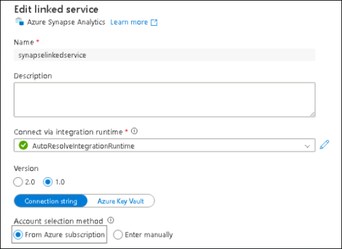
           
           

1. We will then need to head over to the **Settings (1)** tab and adjust the **Schema name** and **Table name**. If you utilized the script provided earlier to make the target table, the Schema name is **dbo (1)** and the Table name is **cs_detail (2)**.

      

1. Before we finish our work on the data flow, we should preview our data. Previewing our data reveals we only have 3 columns when we are expecting a total of 5. We have lost our Summary and Sentiment columns.

      

1. To correct this, let's use our **Select (1)** tile to change the names as follows to get the expected output values:

    - **Summary**: `interaction_summary` **(2)**
    
    - **CustomerSentiment**: `sentiment` **(3)**

         
    
1. If we return to our **Sink (1)** tile and under **Data preview (2)** click **Refresh (3)**, we will now see our expected 5 columns of output.

      

1. Once you have reviewed the data and are satisfied that all columns are mapped successfully (you should have 5 columns total, all showing data in a string format), we can press **Publish all** at the top to save our current configuration. A window will open on the right side of the screen; press the blue **Publish** button at the bottom left of it to save your changes.

      

1. Your completed and saved Data flow will look like the following:

      

#### **E. Create Synapse Pipeline**

1. Once we have created our **Data flow**, we will need to set up a **Pipeline** to house it. To create a **Pipeline**, navigate to the left-hand menu bar and choose the **Integrate (1)** option. Then click the **+ (2)** at the top of the Integrate menu to **Add a new resource** and choose **Pipeline (3)**.

      

2. Next, we need to add a **Data flow** to our Pipeline. With your new **Pipeline tab (1)** open, go to the **Activities** section and search for `data` **(2)** and select **Data flow (3)** activity and **drag-and-drop (4)** it into your Pipeline.

      

3. Under the **Settings (1)** tab of the **Data flow**, select the **Data flow (2)** drop-down menu and select the name of the data flow you created in the previous step. 
Then expand the **Staging (3)** section at the bottom of the settings and utilize the drop-down menu for the **Staging linked service**. Choose the linked service you created **openailinkedservice (4)** to ensure the **Test connection (5)**. Next, set a **Staging storage folder** at the very bottom and enter **workshop-data/Staging** **(6)**.

      

4. Then click **Publish all** to publish your changes and save your progress, and press the blue **Publish** button at the bottom left of it to save your changes.

#### **F. Trigger Synapse Pipeline**

1. Once you have successfully published your work, we need to trigger our pipeline. To do this, just below the tabs at the top of the studio, there is a *lightning bolt* icon that says **Add trigger (1)**. Click to add a trigger and select **Trigger now (2)** to begin a pipeline run, then when the window opens up, click on **OK**.

      
    
2. To look at the pipeline run, navigate to the left-hand side of the screen and choose the **Monitor (1)** option. Then select the **Pipeline runs (2)** option in the **Integration** section. You will then see the pipeline run that you have triggered under the **Triggered (3)** section as **Pipeline 1 (4)**. This pipeline should take approximately 4 minutes (if you are using the uploaded data for the workshop).

      


> **Congratulations** on completing the task! Now, it's time to validate it. Here are the steps:
> - If you receive a success message, you can proceed to the next task.
> - If not, carefully read the error message and retry the step, following the instructions in the lab guide. 
> - If you need any assistance, please contact us at cloudlabs-support@spektrasystems.com. We are available 24/7 to help you out.

  <validation step="dbae07c1-9770-48f1-98a2-a7c05efba22d" />

### Task 3: Query Results in Our SQL Table

1. Ensure that your pipeline run status has **Succeeded**.

      

2. Now that the data is in the target table, it is available for usage by running SQL queries against it or connecting Power BI and creating visualizations. Upload some of the transcript files to the generated_documents folder in your container and see how it creates a new file in the cleansed_documents folder.

3. To query the new data, navigate to the menu on the left-hand side, and choose **Develop (1)**. Click on the existing **SQL Script (2)** and replace the content with the **SQL Code (3)** below. Then select **openaisql01 (4)** pool **Run (5)**. 

     ```SQL 
    SELECT sentiment, count(*) as "Sum of Sentiment"
    FROM [dbo].[cs_detail]
    GROUP BY sentiment
    ORDER BY count(*) desc     
     ```

    - Your query results, if you are using the files uploaded as part of this repository or the workshop, you should see similar **Results (6)** to those below.

         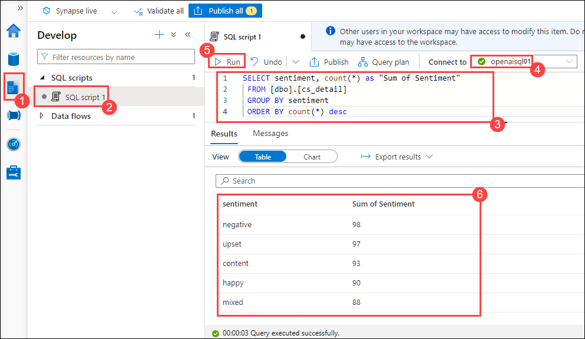

# Exercise 2: Build an Open AI application with Power App 

### Estimated Duration: 90 minutes

This lab focuses on creating an application using OpenAI capabilities integrated with Microsoft Power Apps. Participants will learn how to build a functional application that leverages AI for tasks such as natural language understanding, data analysis, or customer interaction within the Power Apps framework.

1. Open a new tab and navigate to https://make.powerapps.com/. On **Welcome to Power Apps**, select your **Country/Region (1)** and click **Get Started (2)**. 

   
    
2. Select **Apps** on the left navigation, click on **Import app** dropdown and select **From package (.zip)**. 

    

3. On the **Import package** page, click on **Upload**.

    

4. Navigate to `C:\labfile\OpenAIWorkshop-main\scenarios\powerapp_and_python\powerapp` Select the **OpenAI-Playground_20230302010547.zip (1)** folder and click on **Open (2)**.

     

5. Once the zip file is uploaded, in the **Review Package Content** for **OpenAI Playground**, click on the setup icon under **Action**.

     

6. In the **Import setup** pane, select **Create as new (1)** from the drop-down for **Setup** and click on **Save (2)**.

      

7. Repeat Steps 5 and 6 for **Openaisummarization**.

8. Next, click on **Import** to import the package into the PowerApps environment.

   

9. Once the import is completed,click on **Apps (1)**, then click on `⋮` **(2)** next to **OpenAI Playground**, and click on **Edit (3)**.

      

   >**Note:** If you're unable to see the **OpenAI Playground** option, please wait for 5 minutes, and in the meantime, try refreshing the page.

11. You will observe that it has imported the Power App canvas app and the Power Automate Flow into the workspace.

      

      >**Note:** If you see **Welcome to Power Apps Studio**, click **Skip** button.

12. To navigate back, click on **Back (1)**, then click **Leave (2)**.

      

13. Next, on the **Flows (1)** tab, select radio button  for **Openaisummarization (2)**, then click on `...` **(3)** and **Turn on (4)** your flow.

      

      >**Note:** If you see **Welcome to Power Automate**, click **Get started** button.

14. Click on **Edit** for Openaisummarization.

      

15. Edit the Power Automate Flow HTTP step by updating the **https://your-resource-name.openai.azure.com/** with **<inject key="OpenAIEndpoint" enableCopy="true"/>** **(1)**, **deployment-id** with **<inject key="openaimodulename" enableCopy="true"/>** **(2)**, **api-version** with **2023-09-15-preview** **(3)**, **YOUR_API_KEY** with **<inject key="OpenAIKey" enableCopy="true"/>** **(4)**, and click on **Save** **(5)**.

      
   
16. From the **Apps (1)** page, click on the radio button for **OpenAI Playground** app to run the app by clicking on the **Play (2)** button.

     

17. If you get a popup asking to start a free trial, click on **Start a free trial**, then on **You need a Power Apps license to use this app** window, select **Start a 30-day trial**. Choose your region from the drop-down menu and click on the **Start my trial** button. Wait for 2-3 minutes. It might take to start the trial.
    
18. In the **Canvas**, click on **Summary** **(1)** button and verify the **auto-filled text** **(2)**. Then click on the **Submit** **(3)** button to get the desired **Summary** **(4)**.

     

    > **Note:** You can try the other available options in the portal, i.e., **SQL**, **ClassifyText**, **Parse**, and **Classify**.

## Exercise 3: Build an Open AI application with Python

#### Estimated Duration: 60 minutes

In this lab, participants will develop an application using OpenAI's APIs and Python programming language. The goal is to demonstrate how to implement AI functionalities such as language generation, sentiment analysis, or recommendation systems using Python, leveraging OpenAI's powerful models and tools.

1. Search and select **Azure Synapse Analytics** in the Azure portal.

      

1. On **Azure Synapse Analytics** window select **asaworkspace<inject key="DeploymentID" enableCopy="false"/>**.   

1. On the **Overview** blade under the **Getting started** section, click **Open** to open Synapse Studio.
     
     
    
1. Click on **Develop (1)**, then click on **+ (2)**, and select **Import**.

    

1. Navigate to the `C:\labfile\OpenAIWorkshop\scenarios\powerapp_and_python\python` location and select `OpenAI_notebook.ipynb`, then click on **Open**.

     

1. Select **openaisparkpool** from the drop-down menu of **Attach to**.

    

1. Run the notebook step-by-step to complete this exercise. Click on the **Run** button next to the cell.

     

1. In **1. Install OpenAI**, click on the **Run** button next to the first cell, and click on the **stop session**. Please wait till **Apache Spark pools** turn to the stop state. 

     

      > **Note**: You may need to restart the kernel to use updated packages

1. In **2. Import helper libraries and instantiate credentials**, and replace the **AZURE_OPENAI_API_KEY** and **AZURE_OPENAI_ENDPOINT** with your API key and endpoint URL.

     
   
1. From Azure Portal, navigate to the **openaicustom-<inject key="DeploymentID" enableCopy="false"/>** resource group, and select the **asaworkspace<inject key="DeploymentID" enableCopy="false"/>** Azure OpenAI resource.

    

1. Under Resource Management, select **Keys and Endpoint (1)**, and click **Show Keys (2)**. Copy **Key 1 (3)** and **Endpoint (4)**, and replace the **AZURE_OPENAI_API_KEY** and **AZURE_OPENAI_ENDPOINT** with your API key and Endpoint URL in the script.

   
     
    > **Note:** If you encounter an error "Openai module not found", enter `%` in before the **pip install** in the Install OpenAI cell and re-run the notebook again.

1. For **2. Choose a Model**, and replace the **model** value from **text-curie-001** to **demomodel**.

    

1. In **temperature**, replace **engine** value from **text-curie-001** to **demomodel**.

     

1. In **top_p**, replace **engine** value from **text-curie-001** to **demomodel**.

     

1. For **n**, replace **engine** value from **text-curie-001** to **demomodel**.

     

1. In **logprobs**, replace **engine** value from **text-curie-001** to **demomodel**.

     

1. After running the notebook successfully, click on **Publish all**.

     

1. Then click on **Publish** to save the changes. 

    

      <validation step="8731172f-4dc0-41e3-b500-a396412ffb59" />

## Exercise 4a: Introduction to Prompt Engineering & Azure AI Foundry portal

#### Estimated Duration: 90 minutes

In this lab, you'll explore the concept of prompt engineering, learning how to craft effective prompts for AI models. You'll get hands-on experience with Azure OpenAI Playground, experimenting with different types of prompts and understanding their elements and design tips.

### Topics

- [What is a prompt?](#what-is-a-prompt)
- [What is prompt engineering?](#what-is-prompt-engineering)
- [Trying out Prompt Engineering with Azure OpenAI Playground](#Trying-out-Prompt-Engineering-with-Azure-OpenAI-Playground)
- [Basic Prompt Examples](#basic-prompt-examples)
- [Elements of a Prompt](#elements-of-a-prompt)
- [Chat playground parameters](#Chat-playground-parameters)
- [General Tips for Designing Prompts](#general-tips-for-designing-prompts)


### What is a prompt?


We've all seen the blinking cursor. Waiting expectantly for us to act, denoting our chance to provide input...

One way to think of a prompt is as a piece of text that is used to initiate or provide context for the generation of output, primarily natural language in our use cases, by the language model. This could be an input sentence, question, or topic to generate a response from the language model.

### What is prompt engineering?
Prompt engineering is a relatively [new discipline](https://www.businessinsider.com/prompt-engineering-ai-chatgpt-jobs-explained-2023-3) for developing and optimizing prompts to efficiently use language models (LMs) across a wide variety of business applications. Prompt engineering skills help to better understand the capabilities and limitations of large language models (LLMs) and refine the completions (outputs) of LLMs. Prompt engineering is used to improve the capacity of LLMs on a wide range of common and complex tasks, such as question answering and arithmetic reasoning. Developers use prompt engineering to design robust and effective prompting techniques that interface with LLMs and other tools.

This guide covers the basics of standard prompts to provide a rough idea of how to interact with and instruct the LLMs found on [Azure AI Foundry portal's Playground](https://oai.azure.com/portal/playground). 

####  Trying out Prompt Engineering with Azure OpenAI Playground
Azure AI Foundry portal provides access to model management, deployment, experimentation, customization, and learning resources. The Chat playground within Azure AI Foundry portal is based on a conversation-in, message-out interface. You can initialize the session with a system message to set up the chat context.

In the Chat playground, you're able to add few-shot examples. The term few-shot refers to providing a few of examples to help the model learn what it needs to do. You can think of it in contrast to zero-shot, which refers to providing no examples.

In the Assistant setup, you can provide few-shot examples of what the user input may be, and what the assistant response should be. The assistant tries to mimic the responses you include here in tone, rules, and format you've defined in your system message.
Let's go ahead and launch the Azure AI Foundry playground to learn about prompt engineering. 

1. In the **Azure portal**, search for **OpenAI** and select **Azure OpenAI**.

   

1. On **Azure AI services | Azure OpenAI** blade, select **openai-<inject key="DeploymentID" enableCopy="false"/>**

1. In the Azure OpenAI resource pane, click on **Go to Azure Azure AI Foundry Portal** it will navigate to **Azure AI Foundry portal**.

   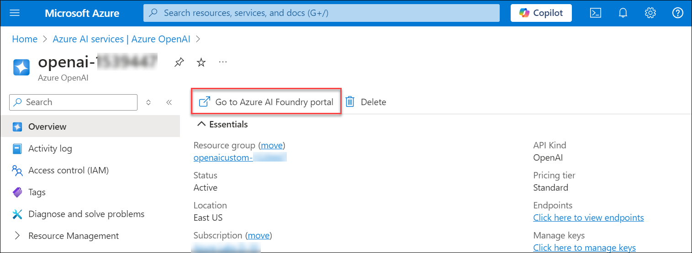

1. In the **Azure AI Foundry
| Azure OpenAI Service**, click on **Chat** under play **Playgrounds** from the left menu.

    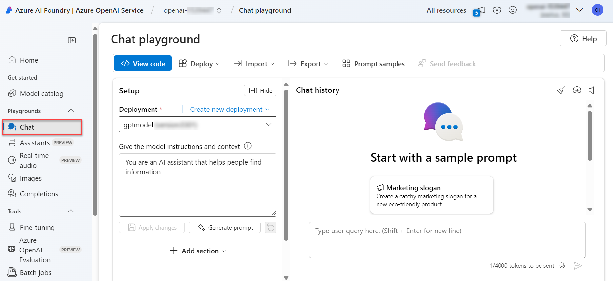

1. In the **Chat** section, give any query from the **Chat session** **(2)** to get the response from the openai. 

   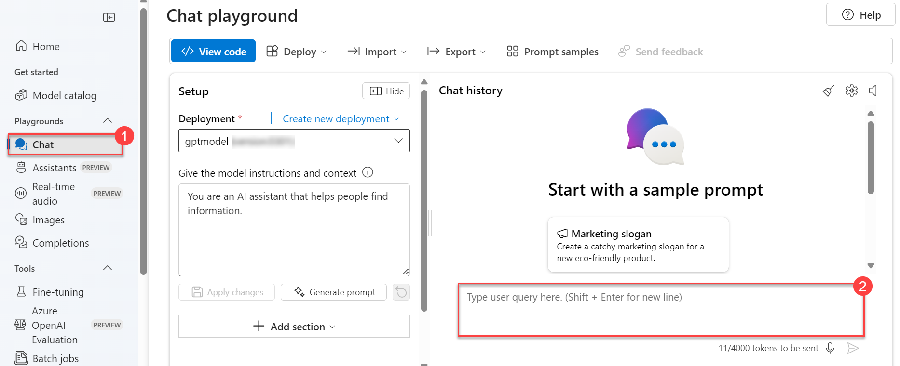
   
   > **Note**: Chat may not respond with the exact output as shown in the screenshots. Following are the examples of what you'll most likely see in this exercise, but the response may vary.
 
---
### Basic Prompt Examples

> **Note:** Please feel free to enter anything listed in the `Prompt:` box into a `gpt-35-turbo-instruct` model in the [Azure AI Foundry portal's Playground](https://oai.azure.com/portal/playground) to follow along with these prompt examples. Be aware that you may receive different outputs than what is listed in the `Output:` box, given the nature of generative models

You can achieve a lot with prompts, but the quality of results depends on how much information you provide in the prompt without being overly descriptive. A prompt can contain information like instructions or questions. As we will learn later with more advanced prompts, we can also supply examples of required outputs as well as context for our instructions.

Here is a basic example of a simple prompt:

*Prompt:*
```
GPT-3 is
```
*Output:*
```
 an autoregressive language model that was developed by OpenAI. It stands for Generative Pre-trained Transformer 3.
 It is a large-scale language model that uses deep learning techniques to generate human-like text. GPT-3 uses a
 transformer-based architecture to generate text with context
```
> **Note:**  The `Output` in our example ends abruptly because our **Max length (tokens)** variable is set to `=60`. **Max Length (tokens)** sets a limit on the number of tokens to generate in a response. The `gpt-35-turbo-instruct` model supports a maximum of 4000 tokens shared between a given prompt and response completion. (One token is roughly 4 characters for typical English text.)

The `Output:` is a series of strings that make sense given the context provided by our prompt of `"GPT3-3 is"`. However, the output may be unwanted or unexpected based on our use case. How can we refine, or engineer, our prompt to achieve our desired output?

The first thing we can do is provide explicit instructions as to what we want the model to do with our previous prompt. This is what is meant by _prompt engineering_: refining the input to produce the best output from the LLM.

*Prompt:*
```
Tell me a joke that begins with: GPT-3 is
```

*Output:*
```
GPT-3 is so intelligent that it can tell a joke without a punchline.
```

Did our instructions improve our output? Admittedly, this is not the funniest joke ever told. And unlike supervised learning problems, there is no easy error or loss metric to compare between the two outputs. Let's look at exactly what we asked the model to generate and what we received:

| Requirement | Output Meets Requirement? | 
| ------------- | -------- |
| Begin with the words, "GPT-3 is" | Yes, the `Output:` began with the words "GPT-3 is" |
| The output is in the form of a joke | An attempt was made |

---
### Standard Prompts

We looked at two very basic prompts above as well as the output they generated. Now that we are familiar with the basic concepts of prompt engineering, let's look at some common formats for prompts. 

#### Question Format

```
<Question>?
```
#### Question-Answer (QA) Format 
This can be formatted into a QA format, which is standard in a lot of QA datasets, as follows:

```
Q: <Question>?
A: 
```
Another way to think about this, using other common terms, would be:
```
Prompt: <Question>?
Completion: <Answer>
```
#### Few-shot Format
Given the standard format above, one popular and effective technique to prompting is referred to as few-shot prompting where we provide multiple examples. Few-shot prompts can be formatted as follows:

```
<Question>?
<Answer>

<Question>?
<Answer>

<Question>?
<Answer>

<Question>?

```

#### Few-shot Question-Answer (QA) Format
And you can already guess that its QA format version would look like this:

```
Q: <Question>?
A: <Answer>

Q: <Question>?
A: <Answer>

Q: <Question>?
A: <Answer>

Q: <Question>?
A:
```

Keep in mind that it's not required to use the QA format. The format depends on the task at hand. For instance, you can perform a simple classification task and give examples that demonstrate the task as follows:

*Prompt:*
```
This is awesome! // Positive
This is bad! // Negative
Wow that movie was rad! // Positive
What a horrible show! //
```

*Output:*
```
Negative
```
or
*Prompt*
```
The following is a list of companies and the categories they fall into

Facebook: Social media, Technology
LinkedIn: Social media, Technology, Enterprise, Careers
Uber: Transportation, Technology, Marketplace
Unilever: Conglomerate, Consumer Goods
Mcdonalds: Food, Fast Food, Logistics, Restaurants
FedEx:
```
*Output:*
```
Logistics, Delivery, and Shipping
```
Few-shot prompts enable in-context learning, which is the ability of language models to learn tasks given only a few examples. We will see more of this in action in the upcoming advanced prompt engineering sections.

---

### Elements of a Prompt

As we cover more and more examples and applications that are possible with prompt engineering, you will notice that there are certain elements that make up a prompt. 

A prompt can contain any of the following components:

- **Instruction** - a specific task or instruction you want the model to perform

- **Context** - can involve external information or additional context that can steer the model to better responses

- **Input Data** - is the input or question that we are interested in finding a response for

- **Output Indicator** - indicates the type or format of output.

Not all the components are required for a prompt, and the format depends on the task at hand. We will touch on more concrete examples in our upcoming guides.

---

### Chat playground parameters

There are many parameters that you can adjust to change the performance of your model:

- **Parameters**: Custom parameters that alter the model responses. When you are starting out we recommend using the defaults for most parameters

- **Past messages included**: Select the number of past messages to include in each new API request. This helps give the model context for new user queries. Setting this number to 10 will include 5 user queries and 5 system responses.

-  **Temperature**: Controls randomness. Lowering the temperature means that the model produces more repetitive and deterministic responses. Increasing the temperature results in more unexpected or creative responses. Try adjusting temperature or Top P but not both.

- **Max response (tokens)**:	Set a limit on the number of tokens per model response. The API on the latest models supports a maximum of 128,000 tokens shared between the prompt (including system message, examples, message history, and user query) and the model's response. One token is roughly four characters for typical English text.

- **Top p**:	Similar to temperature, this controls randomness but uses a different method. Lowering Top P narrows the model’s token selection to likelier tokens. Increasing Top P lets the model choose from tokens with both high and low likelihood. Try adjusting temperature or Top P but not both.

- **Stop sequences**:	Stop sequence make the model end its response at a desired point. The model response ends before the specified sequence, so it won't contain the stop sequence text. For GPT-35-Turbo, using <|im_end|> ensures that the model response doesn't generate a follow-up user query. You can include as many as four-stop sequences.

- **Frequency penalty**: Reduces the chance of repeating a token proportionally based on how often it has appeared in the text so far. This decreases the likelihood of repeating the exact same text in a response.

- **Presence penalty**: Reduce the chance of repeating any token that has appeared in the text at all so far. This increases the likelihood of introducing new topics in a response.

The Current token count is viewable from the Chat playground. Since the API calls are priced by token and it's possible to set a max response token limit, you'll want to keep an eye out for the current token count to make sure the conversation-in doesn't exceed the max response token count.

### General Tips for Designing Prompts


Here are some tips to keep in mind while you are designing your prompts:

#### Start Simple
As you get started with designing prompts, you should keep in mind that it is an iterative process that requires experimentation to get optimal results. Using a simple playground like [Azure's OpenAI Studio's Playground](https://oai.azure.com/portal/playground) will allow you to test out ideas quickly and easily. The model won't be offended if you ask it to do very similar things over and over again!

You can start with simple prompts and keep adding more elements and context as you aim for better results. Versioning your prompt along the way is vital for this reason. As we read the guide, you will see many examples where specificity, simplicity, and conciseness will often give you better results. Begin with a hardcoded prompt and move into more dynamically generated prompts as you refine your results.

#### The Instruction
You can design effective prompts for various simple tasks by using commands to instruct the model what you want to achieve, such as "Write", "Classify", "Summarize", "Translate", "Order", "Create", "make," etc.

Keep in mind that you also need to experiment a lot to see what works best. Try different instructions with different keywords, context, and data and see what works best for your particular use case and task. Usually, the more specific and relevant the context is to the task you are trying to perform, the better. 

Others recommend that instructions be placed at the beginning of the prompt. It's also recommended that some clear separators, like "###" be used to separate the instruction and context. 

For instance:

*Prompt:*
```
### Instruction ###
Translate the text below to Spanish:

Text: "hello!"
```

*Output:*
```
Texto:¡Hola!
```

#### Specificity
Be very specific about the instructions and tasks you want the model to perform. The more descriptive and detailed the prompt is, the better the results. This is particularly important when you have a desired outcome or style of generation you are seeking. There aren't specific tokens or keywords that lead to better results. It's more important to have a good format and a descriptive prompt. Providing examples in the prompt is very effective in getting the desired output in specific formats. 

When designing prompts, you should also keep in mind the length of the prompt, as there are limitations regarding how long this can be. Thinking about how specific and detailed you should be is something to consider. Too many unnecessary details are not necessarily a good approach. The details should be relevant and contribute to the task at hand. This is something you will need to experiment with a lot. We encourage a lot of experimentation and iteration to optimize prompts for your applications.

As an example, let's try a simple prompt to extract specific information from a piece of text.

*Prompt:*
```
There are many fruits that were found on the recently discovered planet Goocrux. There are neoskizzles that grow there.
which are purple and taste like candy. There are also heckles, which are a greyish-blue fruit and are very tart.
a little bit like a lemon. Pounits are a bright green colour and are more savoury than sweet. There are also plenty of
loop novas, which have a neon pink flavour and taste like cotton candy. Finally, there are fruits called glowls, which have
a very sour and bitter taste that is acidic and caustic, and have a pale orange tinge to them.

Please make a table summarizing the fruits from Goocrux
| Fruit | Color | Flavor |
| Neoskizzles | Purple | Sweet |
| Loheckles | Grayish blue | Tart |
```

*Output:*
```
| Pounits | Bright green | Savory |
| Loopnovas | Neon pink | Cotton candy |
| Glowls | Pale orange | Sour and bitter |
```
> **Note:** The instructions are `Please make a table summarizing the fruits from Goocrux`, and then a sample table with column headings and two examples, with the correct elements in their respective columns, are supplied, making this a few-shot prompt.

#### Avoid Impreciseness

Given the tips above about being detailed and improving format, it's easy to fall into the trap of wanting to be too clever about prompts and potentially creating imprecise descriptions. It's often better to be specific and direct. The model doesn't mind you being explicit in your instructions; you can't offend it! The analogy here is very similar to effective communication: the more direct, the more effectively the message gets across.

For example, you might be interested in learning the concept of prompt engineering. You might try something like:

*Prompt:*
```
Provide a short explanation of what prompt engineering is in NLP without using technical language
```
*Output:*
```
Prompt engineering in NLP is the process of creating questions or prompts to help a computer understand
natural language. It involves creating questions or statements that can be used to prompt a computer to generate
a response in natural language.
```
It's not clear from the prompt above how many sentences to use, what style we need things output in, or what we intend to take away from the output. You might get passable responses with the above prompt; the better prompt would be very specific, concise, and to the point. Something like:
*Prompt:*
```
Provide a list with five bullet points, one sentence each, describing the benefits of prompt 
engineering when interacting with a large language model using an 8th-grade reading-level comprehension
```
*Output:*
```
• Increases efficiency by reducing the need for user input.
• Improves the user experience by reducing the time spent waiting for a response.
• reduces cognitive load by simplifying language and providing clear instructions.
• enhances accuracy by providing a consistent format for language input.
• Enhances scalability by allowing for the integration of more complex language models.
```

#### To do or not to do?
Another common tip when designing prompts is to avoid saying what not to do but say what to do instead. This encourages more specificity and a focus on the details that lead to good responses from the model.

Here is an example of an IT support chatbot failing to uphold our instructions because the instructions are phrased negatively. 

*Prompt:*
```
The following is an exchange between an IT support agent and a customer. The customer is locked out of their account. DO NOT ASK FOR THEIR PASSWORD. DO NOT ASK ABOUT PERSONAL INFORMATION.

Customer: I cannot log into my account.
IT Support Agent:
```

*Output:*
```
Okay, I understand. Can you please tell me the email address you are trying to log in with?
```

Here is a better prompt:

*Prompt:*
```
The following is an exchange between an IT support agent and a customer. The customer is locked out of their account. The IT Support Agent must not discuss personal information such as username, password, name, email address, account number, or phone number, or security questions. If the IT Support Agent needs personal information to assist the customer, the IT Support Agent must ask them to click on the "Forgot Password?" link on the sign-on page and follow the on-screen instructions.

Customer: I cannot log into my account.
IT Support Agent:
```

*Output:*
```
I apologize that you are having difficulty accessing your account. Please click on the "Forgot Password?" link on the sign-on page and follow the on-screen instructions to reset your password and access your account.
```

Some of the examples above were adopted from the ["Best practices for prompt engineering with OpenAI API" article](https://help.openai.com/en/articles/6654000-best-practices-for-prompt-engineering-with-openai-api) and the 
[Democratizing Artificial Intelligence Research, Education, and Technologies's Prompt Engineering Guide](https://github.com/dair-ai/Prompt-Engineering-Guide)

## Exercise 4B: Advanced Concepts (Read-Only)

#### Estimated Duration: 30 minutes

This lab provides in-depth theoretical and advanced practical knowledge related to OpenAI and its applications. It covers the introduction to promot engineering and it's use cases and various types of prompts one can implement to fetch the desired results.

### Topics

  - [Introduction](#introduction)
  - [Zero-Shot Prompts](#zero-shot-prompts)
  - [One-Shot Prompts](#one-shot-prompts)
  - [Few-Shot Prompts](#few-shot-prompts)


### Introduction

At this point, you have experienced the power and flexibility of prompts. Tuning prompts to get the desired results is the idea behind prompt engineering.

We will now cover some more advanced topics to tune our outputs without introducing the fine-tuning of our GPT models.

Let's take a simple classification example:

*Prompt:*
```
Classify the sentiment of the text below.

Text: I think this movie was terrible. What a waste of time.
```

*Output:*
```
Negative
```

The output seems to be correct, but we could improve it by providing more information to the model if we wanted a more granular classification. Let's do this via a Zero-Shot prompt.

---

### Zero-Shot Prompts

The GPT LLMs are trained on such large amounts of data that they are capable of understanding complex instructions to lead to the desired output in most cases. This is called 'Zero-Shot' prompt.

We could refine the example below by being more descriptive about our instructions.

*Prompt:*
```
Classify the sentiment of the text below into very negative, negative, neutral, positive, and very positive.

Text: I think this movie was terrible. What a waste of time.
```

*Output:*
```
Very Negative
```

This is called Zero-Shot. A precise instruction leads to the desired output without any examples.

---

### One-Shot Prompts

Sometimes it may be easier to provide an example of the model to learn from. This is called 'One-Shot' prompt.

First, let's do a Zero Shot prompt.

*Prompt:*
```
Tell me in which city a university is located.

University: UCLA
```

*Output:*
```
City: Los Angeles, California
```

Let's say you wanted to have a specific output for this prompt. You could provide an example of the model to learn from.

Here's a One-Shot Prompt that leads to the same output.

*Prompt:*
```
Tell me in which city a university is located.

University: UCLA
City: Los Angeles, CA, USA

University: MIT
```

*Output:*
```
City: Cambridge, MA, USA
```

Note that you could have used the Zero-Shot prompt for this example as well. But One-Shot prompts are more flexible and can be used to fine-tune the model to your needs.

Here's a Zero-Shot Prompt equivalent.

*Prompt:*
```
Tell me in which city a university is located. Provide the city name, state code and country, comma separated as one line.

University: UCLA
```

*Output:*
```
City: Los Angeles, CA, USA
```

---

### Few-Shot Prompts

Few-Shot prompts enable you to provide multiple examples of the model to learn from. This is useful when you want to fine-tune the output for more complex scenarios where the output may vary based on the input. It may also be a simpler way to define a task than providing detailed, natural language instructions of what you expect.

Here's an example of entity extraction that is well-suited to few-shot prompts.

Let's try it first with a Zero-Shot prompt.

*Prompt:*
```
Generate a JSON document that provides the name, position, and company from the text below.

Text: Fred is a serial entrepreneur. Co-founder and CEO of Platform.sh, he previously co-founded Commerce Guys, a leading Drupal e-commerce provider. His mission is to guarantee that as we continue on an ambitious journey to profoundly transform how cloud computing is used and perceived, we keep our feet well on the ground, continuing the rapid growth we have enjoyed up until now.
```

*Output:*
```
{
  "Name": "Fred",
  "Position": "Co-founder and CEO",
  "Company": "Platform.sh, Commerce Guys"
}
```

Not exactly what we expect (only 'Platform.sh' should come back in 'Company'), and it may be difficult to express that in a Zero-Shot prompt. 

Let's try a Few-Shot prompt. Note that we're going to drop the instructions and just provide the desired output.

*Prompt:*
```
Text: Fred is a serial entrepreneur. Co-founder and CEO of Platform.sh, he previously co-founded Commerce Guys, a leading Drupal e-commerce provider. His mission is to guarantee that as we continue on an ambitious journey to profoundly transform how cloud computing is used and perceived, we keep our feet well on the ground, continuing the rapid growth we have enjoyed up until now.

JSON:
{
  "Name": "Fred",
  "Position": "Co-founder and CEO",
  "Company": "Platform.sh"
}

Text: Microsoft (the word being a portmanteau of "microcomputer software") was founded by Bill Gates on April 4, 1975, to develop and sell BASIC interpreters for the Altair 8800. Steve Ballmer replaced Gates as CEO in 2000 and later envisioned a "devices and services" strategy.

JSON:
```

*Output:*
```
{
  "Name": "Microsoft",
  "Founder": "Bill Gates",
  "Founded": "April 4, 1975",
  "CEO": "Steve Ballmer",
  "Strategy": "Devices and Services"
}
```

Note that the output is not what we want here, but there haven't been enough examples to understand if the goal is to extract key entities or certain entities only.

A few shots prompt will clarify this.

*Prompt:*
```
Text: Fred is a serial entrepreneur. Co-founder and CEO of Platform.sh, he previously co-founded Commerce Guys, a leading Drupal e-commerce provider. His mission is to guarantee that as we continue on an ambitious journey to profoundly transform how cloud computing is used and perceived, we keep our feet well on the ground, continuing the rapid growth we have enjoyed up until now.

JSON:
{
  "Name": "Fred",
  "Position": "Co-founder and CEO",
  "Company": "Platform.sh"
}

Text: Microsoft (the word being a portmanteau of "microcomputer software") was founded by Bill Gates on April 4, 1975, to develop and sell BASIC interpreters for the Altair 8800. Steve Ballmer replaced Gates as CEO in 2000 and later envisioned a "devices and services" strategy.

JSON:
{
  "Name": "Bill Gates",
  "Position": "Co-founder and CEO",
  "Company": "Microsoft"
}

Text: Franck Riboud was born on November 7, 1955, in Lyon. He is the son of Antoine Riboud, the previous CEO, who transformed the former European glassmaker BSN Group into a leading player in the food industry. He is the CEO of Danone.

JSON:
```

*Output:*
```
{
  "Name": "Franck Riboud",
  "Position": "CEO",
  "Company": "Danone"
}
```

Now we can see that the model clearly understands that we want to only extract three entities from the text and nothing else.


## Exercise 4C: Fine Tuning (Read-Only)

#### Estimated Duration: 15 minutes

This lab focuses on the process of fine-tuning OpenAI models to improve their performance on specific tasks or datasets. Participants learn how to adjust model parameters, optimize training strategies, and evaluate model performance metrics through practical exercises and examples.

### Topics

  - [What is Fine Tuning?](#what-is-fine-tuning)
  - [When would you consider Fine Tuning vs Prompt Engineering?](#when-would-you-consider-fine-tuning-vs-prompt-engineering)
  - [Operation Cost Considerations](#operation-cost-considerations)

### What is Fine Tuning?

Fine-tuning is the process of customizing an existing AI model for a specific task or domain by using additional data. OpenAI offers fine-tuning for its language models, such as GPT-3, which can generate natural language texts for various purposes.

Fine-tuning allows users to create customized models that can produce more accurate and relevant outputs than general models.

To fine-tune an OpenAI model, users need to prepare their own training and validation data, select a base model, and use the OpenAI CLI or Studio to start the fine-tuning job.

Fine-tuning can improve the performance and reduce the error rates of OpenAI models significantly.

### Fine Tuning Training Data

Training data for fine-tuning OpenAI models are pairs of input prompts and desired outputs that reflect the specific task or domain you want to customize the model for. For example, if you want to fine-tune a model for generating product reviews, your training data could look like this:

```
{"prompt": "Review: I bought this laptop for my online classes and it works great.", "completion": "Rating: 5 stars"}
{"prompt": "Review: The battery life is terrible and the screen is too small.", "completion": "Rating: 2 stars"}
{"prompt": "Review: This is a scam. The product never arrived and the seller did not respond.", "completion": "Rating: 1 star"}
```

You can use the OpenAI CLI or Studio to prepare, validate, and format your training data into a JSON file that can be used for fine-tuning.

**IMPORTANT NOTE**:
It is important to note that to expect better results than using prompt engineering, you will need to have a large and high-quality dataset that is relevant to your task or domain, usually a few hundred high-quality examples.

### When would you consider Fine Tuning vs Prompt Engineering?

Fine-tuning is a powerful tool that can be used to customize OpenAI models for specific tasks or domains. However, it is not always necessary to fine-tune a model to get the desired results.

Fine-tuning and prompt engineering are two methods of conditioning language models to perform specific tasks or domains.

Fine-tuning involves retraining an existing model on new data, while prompt engineering involves designing and testing input instructions that elicit the desired output from a model.

#### Fine Tuning

You might consider fine-tuning when you have a large and high-quality dataset that is relevant to your task or domain and you want to create a customized model that can produce more accurate and consistent outputs than the general model.

#### Prompt Engineering

You might consider prompt engineering when you have a limited or no dataset and you want to leverage the existing knowledge and capabilities of a general model by asking the right questions or providing the right context.

**IMPORTANT NOTE**: Both methods require some trial and error, but fine-tuning usually takes more time and resources than prompt engineering, and it is not always necessary to fine-tune a model to get the desired results. It is therefore preferable to start with prompt engineering and only consider fine-tuning if you are unable to get the desired results.


### Operation Cost Considerations

Prompt engineering could be less cost-effective if you need to provide a large number of instructions to accomplish something similar to what you would get with a Fine Tuned model as you'd consume tokens with every request sent.

Hosting a Fine Tune model also has its cost, but on medium to high volumes, that cost would be mostly irrelevant, so operational cost efficiency could be a driver for Fine Tuning.

### References

[OpenAI Fine Tuning](https://platform.openai.com/docs/guides/fine-tuning)

[Fine Tuning in the Azure OpenAI Service](https://learn.microsoft.com/en-us/azure/cognitive-services/openai/how-to/fine-tuning?pivots=programming-language-studio)

## Exercise 4D: Basic Overview of Azure OpenAI Service Hyperparameters (Read-Only)

#### Estimated Duration: 15 minutes

This lab provides foundational knowledge on hyperparameters in the context of Azure OpenAI Service. Participants gain understanding of how hyperparameters influence model training and performance, and learn basic techniques for tuning these parameters to achieve better results.

### Quick Note on adjusting Hyperparameters

When working with prompts, you will be interacting with the LLM via an API or directly. You can configure a few parameters to get different results for your prompts.

**Temperature** - In short, the lower the temperature, the more deterministic the results are, in the sense that the most probable next token is always picked. Increasing temperatures could lead to more randomness, encouraging more diverse or creative outputs. We are essentially increasing the weights of the other possible tokens. In terms of application, we might want to use a lower temperature for something like fact-based QA to encourage more factual and concise responses. For poem generation or other creative tasks, it might be beneficial to increase the temperature.

**Top_p** - Similarly, with top_p, a sampling technique with temperature called nucleus sampling, you can control how deterministic the model is at generating a response. If you are looking for exact and factual answers, keep this low. If you are looking for more diverse responses, increase to a higher value.

The general recommendation is to alter one, not both.

#### gpt-35-turbo-instruct model

**temperature**
```
Controls randomness: Lowering results in fewer random completions. 
As the temperature approaches zero, the model will become deterministic and repetitive.
```

**max_tokens**
```
Set a limit on the number of tokens to generate in a response. 
The system supports a maximum of 2048 tokens shared between a given prompt and response completion. 
(One token is roughly 4 characters for typical English text.)
```

**top_p***
```
Control which tokens the model will consider when generating a response via nucleus sampling. 
Setting this to 0.9 will consider the top 90% most likely of all possible tokens. 
This will avoid using tokens that are incorrect while still maintaining variety
when the model has low confidence in the highest-scoring tokens.
```

**frequency_penalty**
```
Reduce the chance of repeating a token proportionally based on how often it has appeared in the text so far.
This decreases the likelihood of repeating the same text in a response.
```

**presence_penalty**
```
Reduce the chance of repeating any token that has appeared in the text at all so far. 
This increases the likelihood of introducing new topics in a response.
```

**best_of**
```
Generate multiple responses, and display only the one with the best total probability across all its tokens. 
The unused candidates will still incur usage costs, so use this parameter carefully and make sure to set the
parameters for max response length and ending triggers as well. Note that streaming will only work when this is set to 1.
```

**stop**
```
Make responses stop at a desired point, such as the end of a sentence or list.
Specify up to four sequences where the model will stop generating further tokens
in a response. The returned text will not contain the stop sequence.
```
## Exercise 4E: Glossary (Read-Only)

#### Estimated Duration: 15 minutes

Azure OpenAI Large Language Models (LLMs) like GPT-4 excel in natural language tasks by generating coherent text. Prompt engineering optimizes input prompts to influence model outputs effectively for desired responses.

*language model (LM)*
```
A probability distribution over sequences of words
```

*large language model (LLM)*
```
A large language model (LLM) is a type of machine learning model that can perform a variety of 
natural language processing (NLP) tasks, including generating and classifying text, answering 
questions in a conversational manner and translating text from one language to another.

The label "large" refers to the number of values (parameters) the model can change autonomously as it learns.
```

*natural language processing (NLP)*
```
Natural language processing (NLP) is the ability of a computer program to understand spoken and written human language.

NLP programming automates the translation process between computers and humans by manipulating unstructured data (words)
in the context of a specific task (conversation). An important goal of NLP is to help the computer comprehend 
the intent -- as well as the meaning -- of a human being's written or spoken words.
```

*prompt*
```
A piece of text that is used to initiate or provide context for the generation of output
This could be an input sentence, question, or topic to generate a response from the language model.
```

*prompt engineering*
```
The discipline concerned with developing and optimizing prompts to efficiently use language models (LMs)
and large language models (LLMs).
```

*token(s)*
```
The token is an abstraction that is defined by external rules to identify the unit of processing in an NLP task.
A token may be a word, part of a word, or just characters like punctuation. (e.g. 'abc ', 'abc.', ' st', etc)
```

### Summary

In this lab series, you gained both theoretical and practical knowledge on various AI concepts and their implementation using Azure OpenAI. You explored large language models (LLMs), natural language processing (NLP), tokens, prompt engineering techniques, and the differences between prompt engineering and fine-tuning, including their operational costs. You experimented with prompt creation in the Azure OpenAI Playground, learning how to design effective prompts. You also acquired knowledge about Azure OpenAI hyperparameters and their functionalities. Additionally, you developed AI-powered applications using Python and Power Apps, integrating OpenAI APIs to enable functionalities such as language generation, sentiment analysis, and personalized recommendations. Furthermore, you ingested data into a Storage account, set up a Synapse Workspace, and produced query results using SQL, demonstrating your ability to work across data and AI platforms.

### You have successfully completed the lab


