# Exercise 1: Build an Open AI Pipeline to Ingest Batch Data, Perform Intelligent Operations, and Analyze in Synapse

### Estimated Duration: 120 Minutes

In this Exercise, you will integrate OpenAI capabilities into Azure Synapse Analytics for processing batch data, performing intelligent operations like natural language processing or predictive analytics, and analyzing the results efficiently within the Synapse environment.

## Exercise Objectives

You will be able to complete the following tasks:

- Task 1: Ingest Data to Storage account
- Task 2: Set up Synapse Workspace
- Task 3: Query Results in Our SQL Table

## Task 1: Ingest Data to Storage account

### A. Launch Azure Cloud Shell

1. In the [Azure portal](https://portal.azure.com?azure-portal=true), select the **[>_]** (*Cloud Shell*) button at the top of the page to the right of the search box. A Cloud Shell pane will open at the bottom of the portal.

    

2. The first time you open the Cloud Shell, you may be prompted to choose the type of shell you want to use (*Bash* or *PowerShell*). Select **Bash**. If you don't see this option, skip the step.

    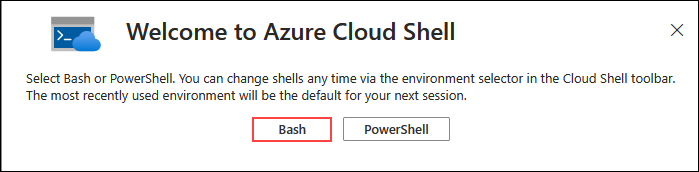

3. Within the Getting Started pane, select **Mount storage account (1)**, select your **Storage account subscription (2)** from the dropdown and click **Apply (3)**.

   .png)

4. Within the **Mount storage account** pane, select **Select existing storage account (1)** and click **Next (2)**.

   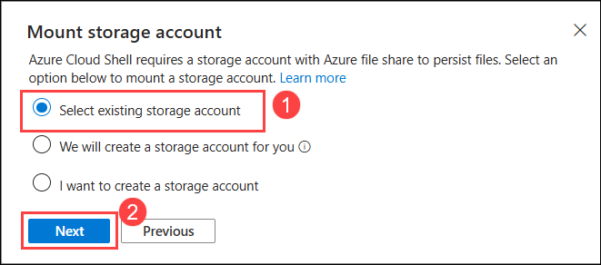

5. Within the **Advanced settings** pane, enter the following details:

    - **Subscription:** Default- Choose the only existing subscription assigned for this lab **(1)**.
    
    - **Resource group:** Select **Use existing** **(2)**

      - openai-<inject key="DeploymentID" enableCopy="false"></inject>

    - **Storage account:** Select **Use existing** **(3)**

      - openaistorage<inject key="DeploymentID" enableCopy="false"></inject>
    
    - **File share:** Create a new file share **(4)**

      .png)

6. Enter the file share name as **blob (1)**, select **OK**, and click on **Select (2)**.

    .png)

7.  Once the storage account is created, you will be prompted with the Bash window, as shown in the screenshot below.
    
    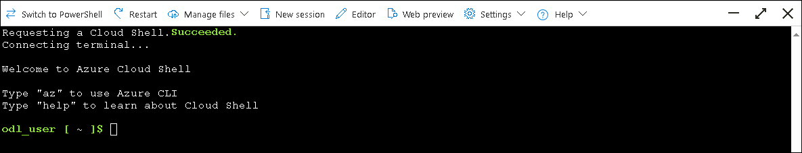

    > **Note:** Please disregard the warning `the storage file share subscription ID is not registered to Microsoft.CloudShell Namespace` and proceed with the next task.

### B. Upload files to a storage account:

1. Run the following commands in the cloud shell to download and install Miniconda.

     ```bash 
     wget https://repo.anaconda.com/miniconda/Miniconda3-py39_23.1.0-1-Linux-x86_64.sh 
     ```

     ```bash 
     sh Miniconda3-py39_23.1.0-1-Linux-x86_64.sh 
     ```
    
    > **Note:** The following commands are issued in Bash; please ensure you are using **Bash** in the Cloud Shell.

1. Press `Enter` to continue with the installation process.
    
      > **Note:** Press the down arrow key to read or skip the license agreement.

      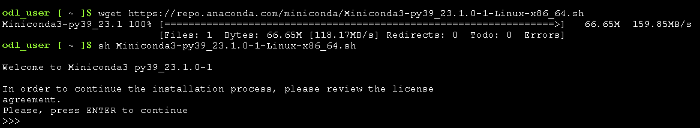

1. Type **yes** and hit **enter** to accept the agreement, and then hit enter to install on the default path.

   

1. Type **yes** and hit **enter** to initialize the conda environment.

    

1. Once the conda environment is installed, you can see the output message like this.
    
    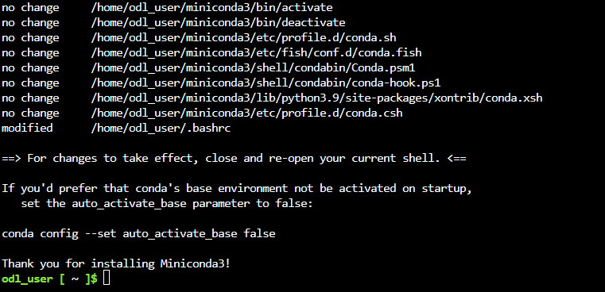

1. Run the below commands one by one to create and activate the conda environment in CloudShell.

    ```bash 
    git clone https://github.com/CloudLabsAI-Azure/openaifilesworkshop.git
    ```

    ```bash
    cd openaifilesworkshop/scenarios/openai_batch_pipeline/document_generation
    ```
    
    ```bash
    source ~/.bashrc
    ```
    
    ```bash
    conda --version
    ```

    ```bash
    conda create -n document-creation
    ```

    ```bash
    conda activate document-creation
    ```

    > **Note:** If you encounter the **"Conda: command not found"** error after running this command, close your current CloudShell session, start a new Bash session, and then try running the below-mentioned commands and then the commands of **Step 6** again.

    ```bash
    pip install --upgrade pip
    pip install -r reqs.txt
    ```

    > **Note:** If you encounter errors while running the above pip commands, execute the commands below:
    
    ```
    pip install --user --upgrade pip
    pip install --user -r reqs.txt
    ```

1. Type **y** and hit Enter to proceed. 
    
    > **Note:** Proceed to the next step if you are not prompted for this.

1. Navigate to the **openai-<inject key="DeploymentID" enableCopy="false"/>** resource group, and then select your Storage Account with the `azfunctions` suffix from the list of resources.

    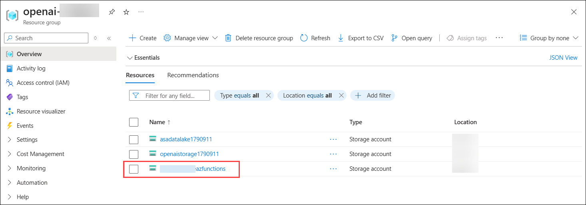
    
1. Navigate to the **Access keys (1)** blade located under the **Security + networking** section. Next, select **Show (2)** to reveal the connection string value. Then, click the copy button next to the first **Connection string (3)**. Finally, paste the copied value into a text editor, such as Notepad, for later reference.

   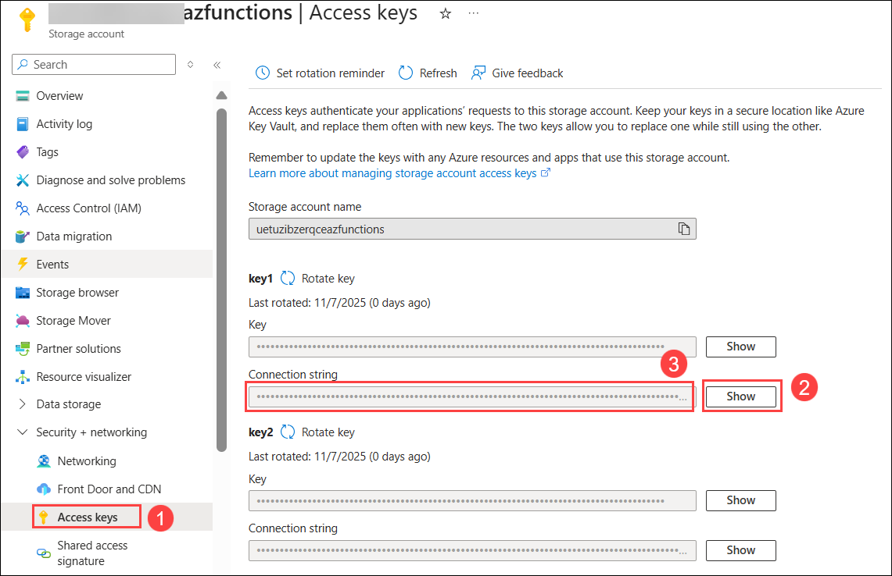

1. Go back to the cloud shell bash session and run the below command to upload the JSON files to the storage account by replacing the **CONNECTION_STRING** you copied in the previous step. This will take a few minutes to complete.

    ```bash 
    python upload_docs.py --conn_string "<CONNECTION_STRING>"
    ```

   

   > **Note:** Make sure you are in the **openaifilesworkshop/scenarios/openai_batch_pipeline/document_generation** directory before running the command. If you are not already in this directory, use the following command to navigate to it:
   
   ```bash
   cd openaifilesworkshop/scenarios/openai_batch_pipeline/document_generation
   ```
      
1. Once the JSON files have been successfully uploaded to the storage account, navigate to **Containers (1)** under the **Data storage** section. Click on **workshop-data (2)**, then open the **cleansed\_documents (3)** folder and verify that the files have been uploaded correctly.

   
   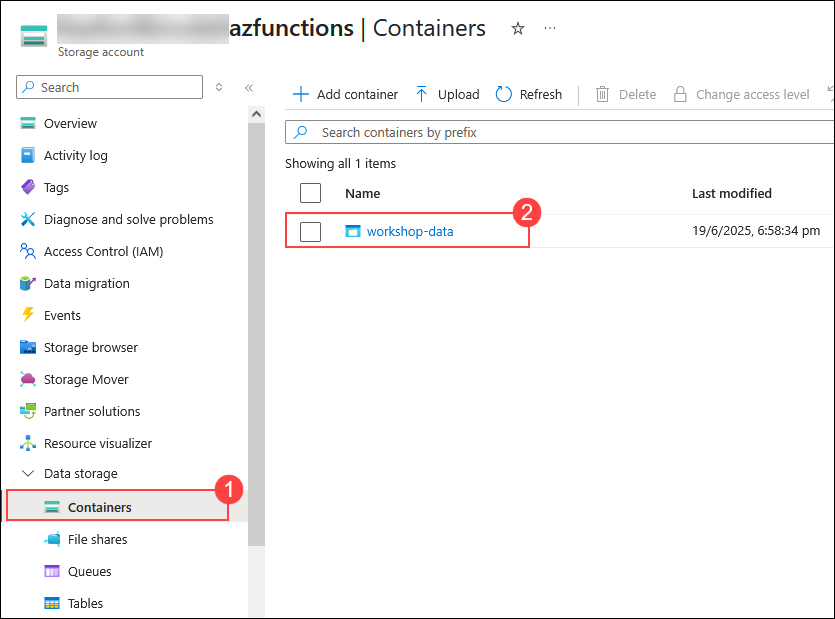

   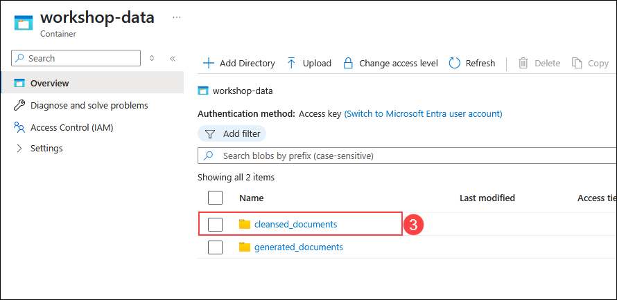

> **Congratulations** on completing the task! Now, it's time to validate it. Here are the steps:
> - If you receive a success message, you can proceed to the next task.
> - If not, carefully read the error message and retry the step, following the instructions in the lab guide. 
> - If you need any assistance, please contact us at cloudlabs-support@spektrasystems.com. We are available 24/7 to help you out.

<validation step="ef9a8088-8af2-426f-9672-70c0b0c227b5" />

## Task 2: Set up Synapse Workspace

### A. Set up Synapse Workspace

1. In Azure portal, search for **Synapse** and select **Azure Synapse Analytics**.

   .png)

2. On the **Azure Synapse Analytics** page, Click on **+ Create**.

   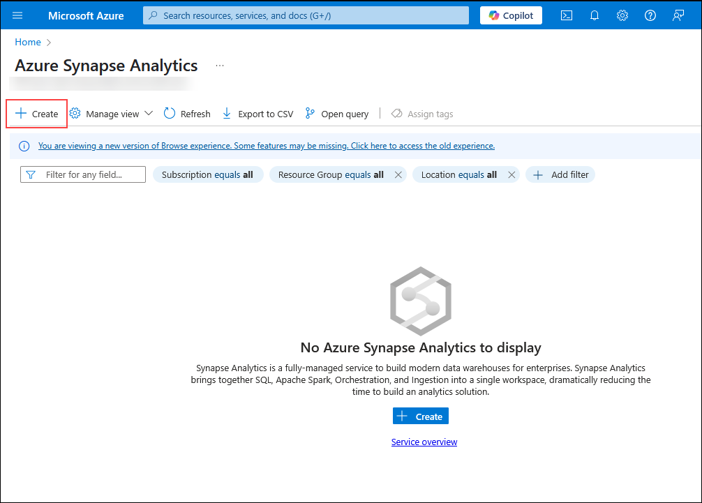

3. You will be navigated to the **Create Synapse Analytics** page, where you will be configuring the Synapse workspace.
   
4. On the **Basics** tab, provide the following details:

   - **Subscription:** Use **Existing Subscription (1)**.
   - **Resource Group:** Use **openai-<inject key="DeploymentID" enableCopy="false"></inject> (2)**
   - **Workspace name:** **synapseworkspace<inject key="DeploymentID" enableCopy="false"></inject> (3)**
   - **Region:** Select Default region **(4)**
   - **Select Data Lake Storage Gen2:** Select **From Subscription (5)**
   - **Account name:** Select **asadatalake<inject key="DeploymentID" enableCopy="false"></inject> (6)**
   - **File system name:** **defaultfs (7)**
   - Click on **Next : Security > (8)**

     .png)

5. On the **Security** tab, ensure that the Authentication method is set to **Use both local and Microsoft Entra ID authentication** and click on **Next: Networking >**.

   .png)

6. On the **Networking** tab, make sure Managed virtual network is **Disable (1)** and **Allow connections from all IP addresses (2)** is checked, then click on **Review + create** and **Create** to deploy the resource.

   .png)

   > **Note:** The deployment might take approximately 5 minutes to complete.
   
7. Once the resource is deployed, click on **Go to resource group**

   .png)

8. On the **Overview (1)** page of the Synapse workspace you created, click on **Open (2)** under **Open Synapse Studio** to launch Azure Synapse Studio.
   
   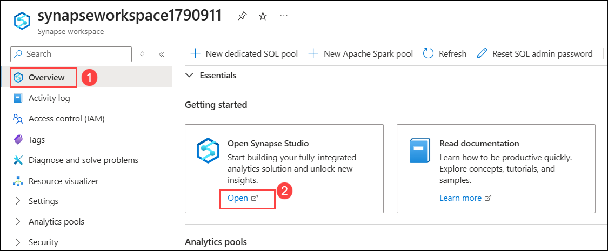

9. In Azure Synapse Studio, go to the **Manage (1)** section, select **SQL pools (2)**, and then click on **+ New (3)** to create a new SQL pool.

    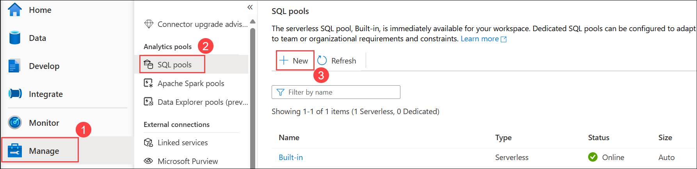

10. On the **Basics** tab of the New dedicated SQL pool, provide the following details:

    - Dedicated SQL pool name: **openaisql01**

    - Performance level: Reduce it to **DW100c**

    - Click on **Review + create**.
   
      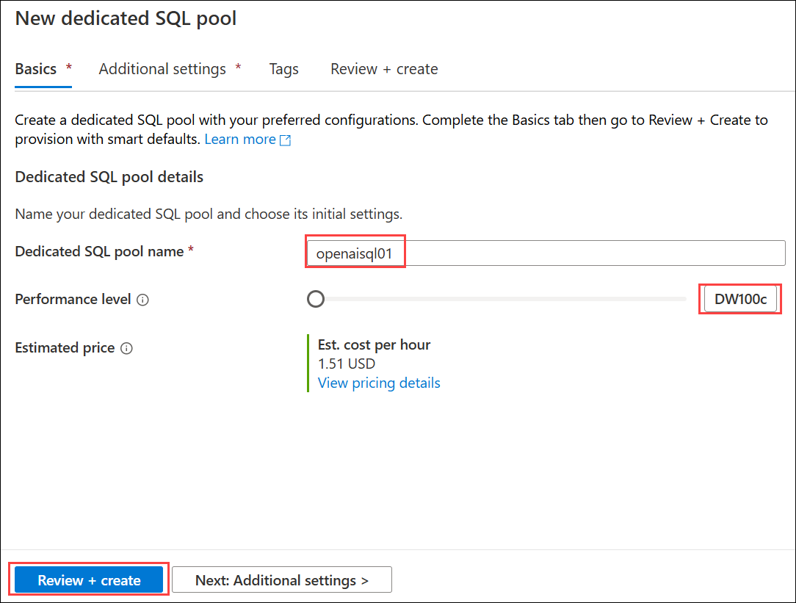
      
11. On **Review + create** page, click on **Create** and wait for the deployment to complete.

    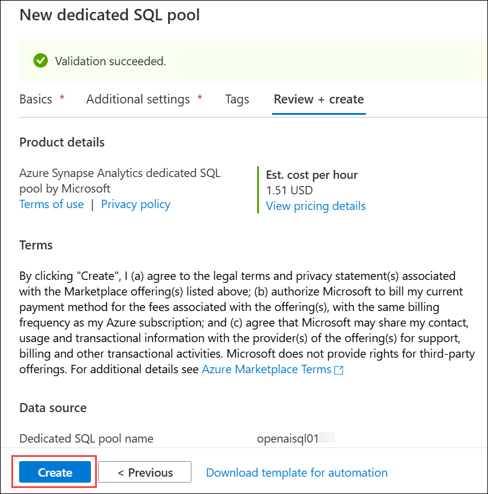

    > **Note:** The deployment might take approximately 10 minutes to complete.

12. Now navigate back to **synapseworkspace<inject key="DeploymentID" enableCopy="false"></inject>**, select **Apache Spark pools (1)** from the left pane under **Analytics pools**, and click on **+ New (2)** to create a new Spark pool.

    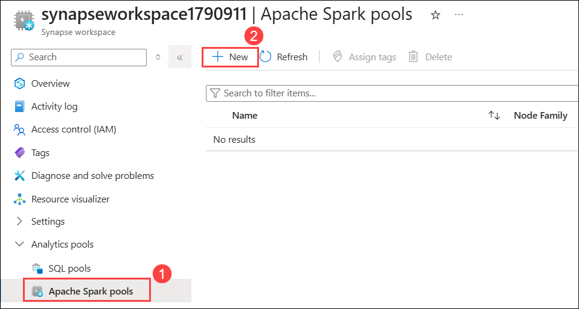  

13. On the **New Apache Spark pool** page, provide the following details and click on **Review + create (6)**, then click on **Create** tab to create the Apache Spark pool.

    - Apache Spark pool name: **openaisparkpool (1)**

    - Isolated Compute: **Disabled (2)**

    - Node size: **Small (4vCores/32GB) (3)**

    - Autoscale: **Disabled (4)**

    - Number of nodes: **3 (5)**

      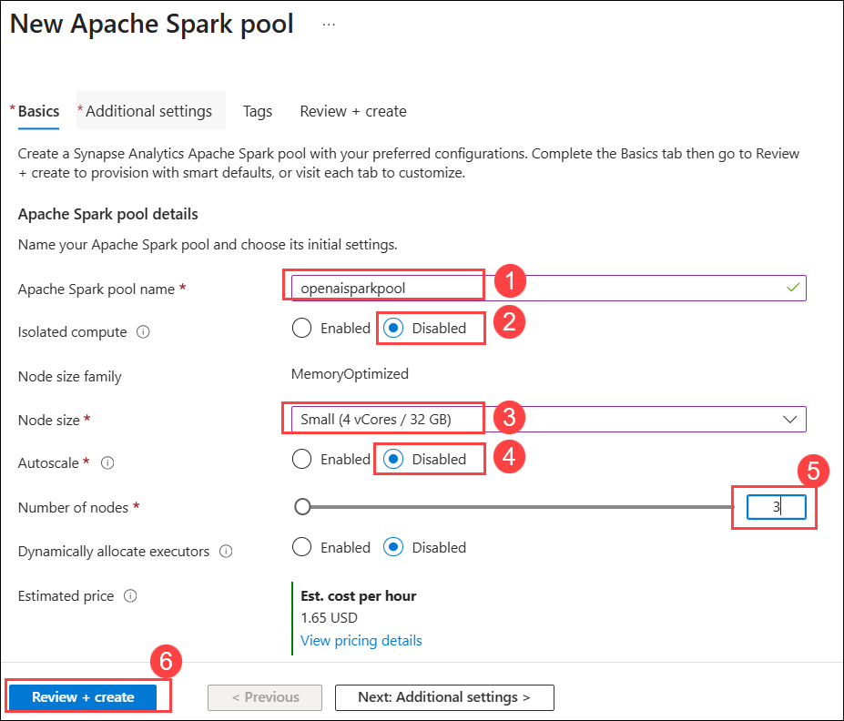
   
### B. Create Target SQL Table

1. Navigate to **synapseworkspace<inject key="DeploymentID" enableCopy="false"/>** Synapse workspace from the **openai-<inject key="DeploymentID" enableCopy="false"/>** resource group. From the **Overview** tab, click on **Open** to launch the Synapse workspace.

      .png)

1. Click into the **Develop (1)** section of Synapse Studio, then click the **+ (2)** icon in the top left corner and select **SQL script (3)**. This will open a new window with the SQL script editor.

      

1. Copy and paste the following script into the editor **(1)**, then change the **Connect to** value by selecting **openaisql01 (2)** from the drop-down. For **Use database**, ensure that **openaisql01 (3)** is selected. Click the **Run (4)** button in the top-left corner to execute the script. Once done, click **Publish all (5)** just above the **Run** button to publish your work so far.


    ```SQL
    CREATE TABLE [dbo].[cs_detail]
    (
    interaction_summary varchar(8000),
    sentiment varchar(500),
    topic varchar(500),
    product varchar(500),
    filename varchar(500)
    )
    ```
    
   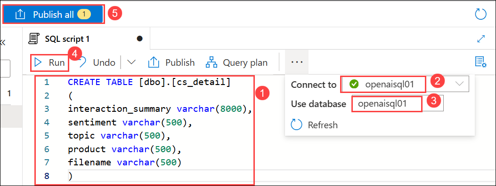
    
1. Next, click on **Publish** to publish the SQL script.

   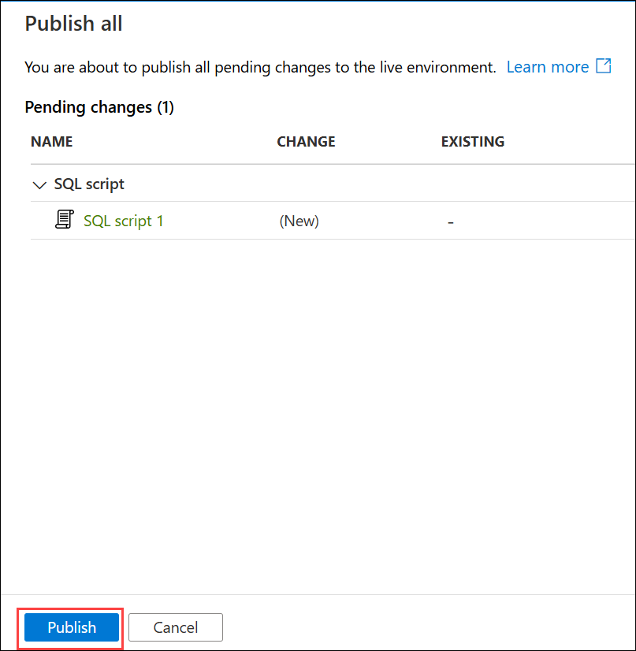

### C. Create Source and Target Linked Services

We'll next need to create two linked services: one for our source (the JSON files in the Data Lake) and another for the Synapse SQL Database that houses the table we created in the previous step.

1. Click back into the **Manage (1)** section of Synapse Studio and select **Linked services (2)** under the **External connections** section. Then, click **+ New (3)** in the top-left corner.

      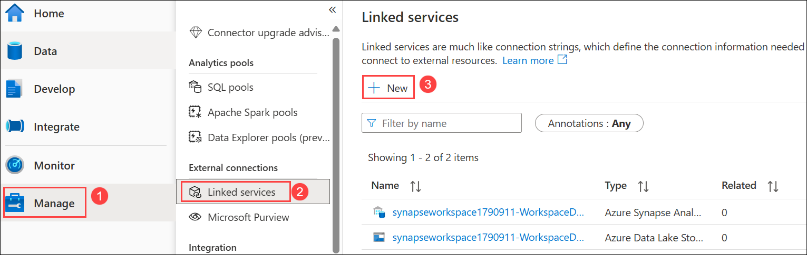
   
1. Start by creating the linked service for the data source the JSON files stored in the ADLS Gen2 storage account created using the initial template. Search for **blob (1)**, select **Azure Blob Storage (2)**, and click **Continue (3)**.

      

1. Provide the name of your linked service as **openailinkedservice (1)**. Change the **Authentication Type** to **Account Key (2)**. Next, select the **subscription (3)** you are working with and finally select the storage account with **azfunctions (4)** as a suffix that you created in the starter template and uploaded the JSON files to. Then click **Test connection (5)**. After the connection is successful, click the blue **Create (6)** button in the bottom left corner of the New Linked Service window.

      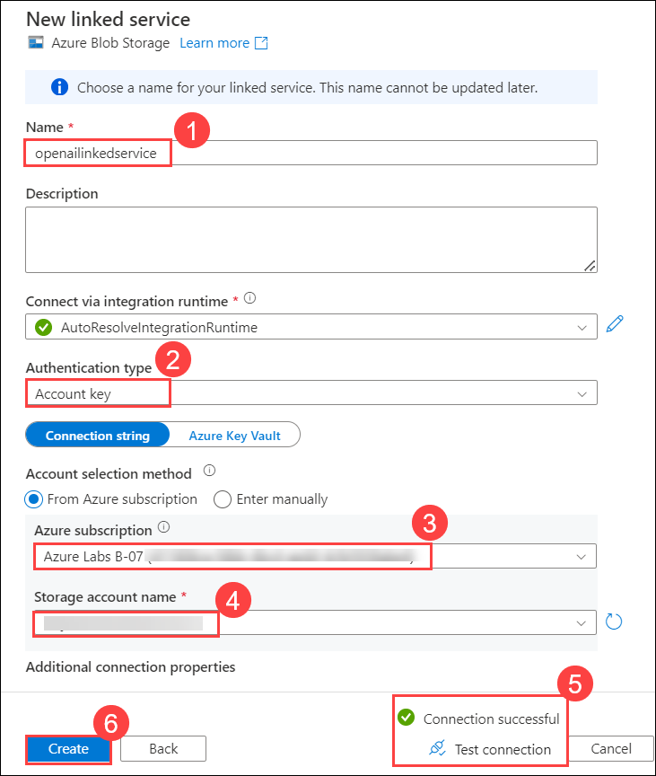

1. Click **+ New** again, search for **Synapse (1)**, select **Azure Synapse Analytics (2)**, and click **Continue (3)**.

      

4. In the New Linked Service window:

   - Enter **synapselinkedservice (1)** as the name
   - Set **Version** to **1.0 (2)**
   - Choose your **Azure Subscription (3)**
   - Select **synapseworkspace<inject key="DeploymentID" enableCopy="false"/> (4)** as the **Server name**
   - Set **Database name** to **openaisql01 (5)**
   - Change **Authentication type** to **System-assigned managed identity (6)**
   - Then click **Test connection (7)** and finally click **Create (8)**.

      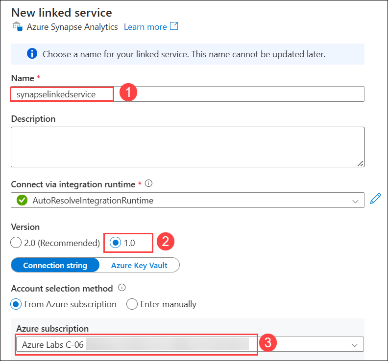

      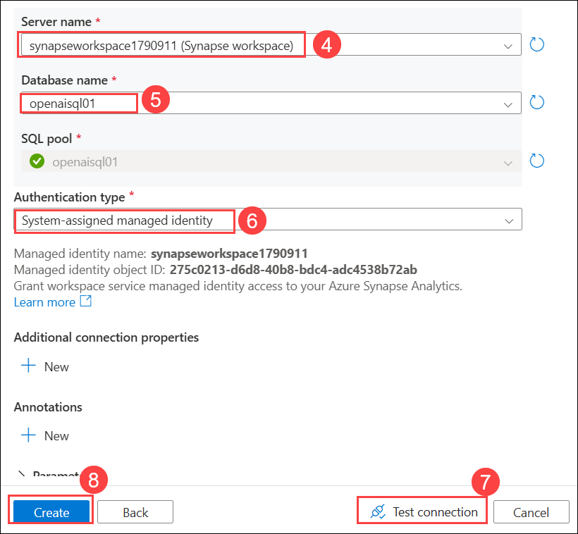

1. After both linked services are created, click **Publish all** at the top of Synapse Studio and then click **Publish**.

      
   
### D. Create Synapse Data Flow

While still within Synapse Studio, we will now create a **Data flow** to ingest JSON data and write it to the SQL database. This data flow will ingest the data, rename some columns, and write it to the target table.

1. Go to the **Develop (1)** tab, click the **+ (2)** icon, and select **Data flow (3)**.

      
   
1. Once the data flow editor opens, click **Add Source**. A panel will appear at the bottom. Select **+ New** on the **Dataset** row, leaving other settings as default.

      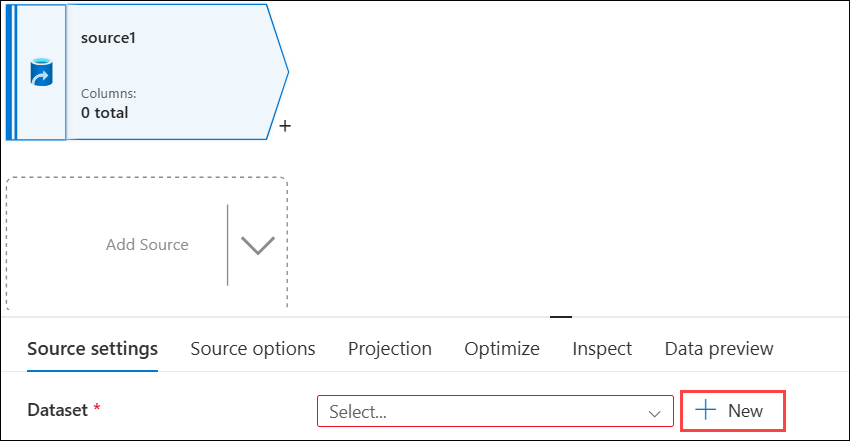

1. In the panel on the right, search for **Azure Blob Storage (1)**, select **Azure Blob Storage (2)**, and click **Continue (3)**.
   
      

1. Choose the **JSON (1)** format for the dataset and click **Continue (2)**.

      

1. Select the linked service named **openailinkedservice (1)** that was created earlier. Under **File path**, choose the directory **workshop-data / cleansed\_documents (2)** where the JSON files are stored, and click **OK**.

      
   
1. Go to the **Source options (1)** panel, expand **JSON settings (2)**, and set **Document form** to **Array of documents (3)**.

      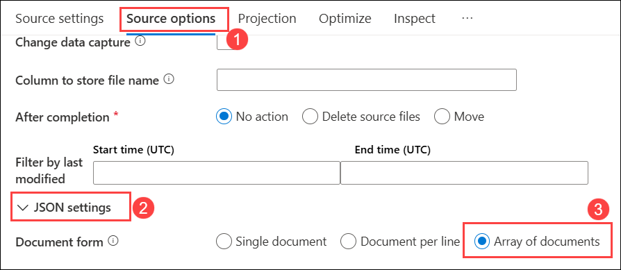   

1. Enable the **Data flow debug** toggle from the top menu bar and click **OK** when the pop-up appears.

      >**Note:** It may take a minute or two for the debug session to initialize.

1. Navigate to the **Data preview** tab and run a preview to verify that data is loading correctly.
    
     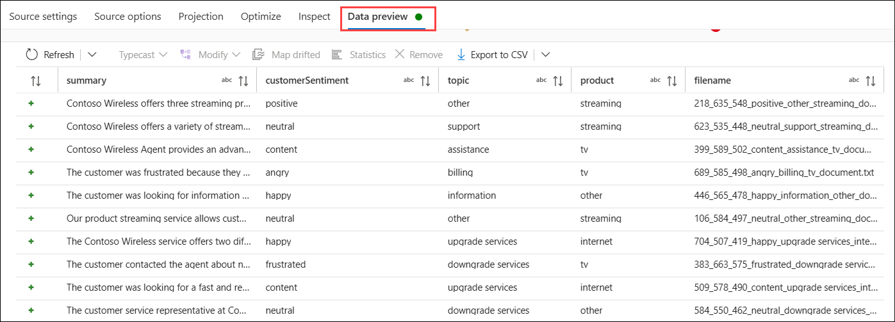
      
      >**Note:** Click the collapse button in the left tab to clearly view the data preview option, making the preview easier to see.
      
      >**Note:** If the preview does not appear immediately, click the **Refresh** button repeatedly until the data loads..
   
1. Next, we can add in our **Select** tile and do our minor alterations before writing the data out to the Synapse SQL table. To begin, click the small **+ (1)** sign next to our ingestion tile and choose the **Select (2)** option.

      

1. We can leave all the settings as defaults. Next, we'll add in our **Sink** tile. This is the step that will write our data out to our Synapse SQL database. Click on the small **+ (1)** sign next to our **Select** tile. Scroll all the way to the bottom of the options menu and select the **Sink (2)** option.

      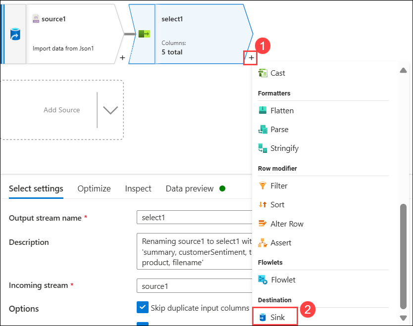

1. In the **Sink (1)** add the below settings:

    - Set **Sink type** to **Inline (2)**,
    - Set **Inline dataset type** to **Azure Synapse Analytics (3)**.
    - Select **synapselinkedservice (4)** as the **Linked service**.
    - Click **Test connection (5)** to verify.

      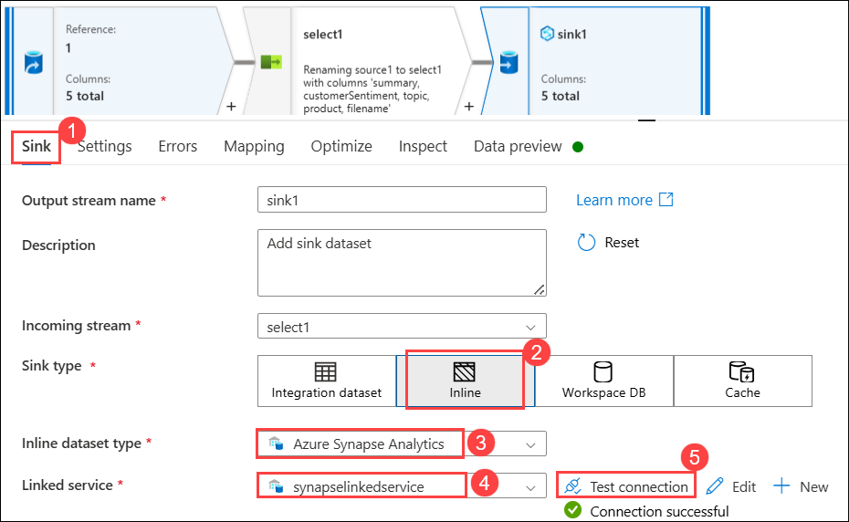

      > **Note:** If the test connection takes more than 3–4 minutes, follow the steps below.

      - Click on **Edit**.

        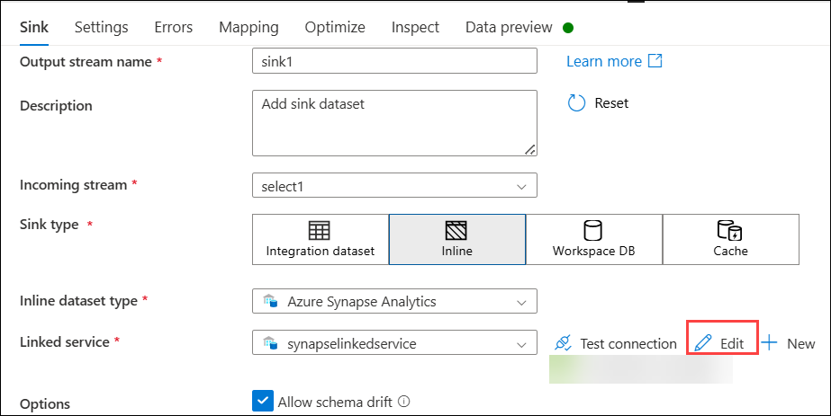    

      - In the Edit linked service window that opens, select the Azure selection method as **From Azure subscription** **(1)**. Select the **Azure subscription (2)** for which you have been working. Select the **synapseworkspace<inject key="DeploymentID" enableCopy="false"/> (3)** for **Server name** and **openaisql (4)** as the **Database name**, and then click on **Test connection (5)** and click **Save (6)**.
      
        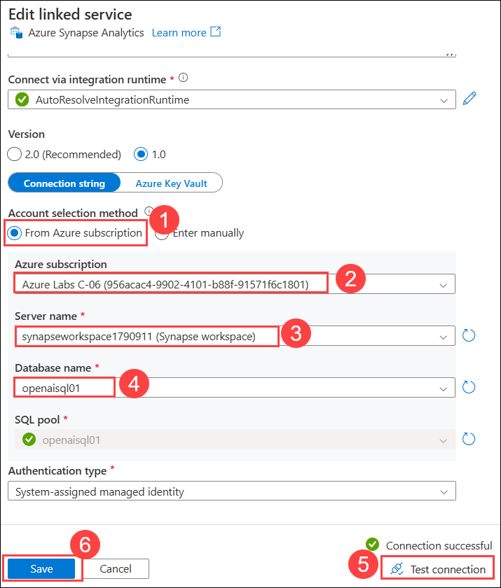

1. We will then need to head over to the **Settings (1)** tab and adjust the **Schema name** and **Table name**. If you utilized the script provided earlier to make the target table, the Schema name is **dbo (2)** and the Table name is **cs_detail (3)**.

      

1. Before we finish our work on the data flow, we should preview our data. Previewing our data reveals we only have 3 columns when we are expecting a total of 5. We have lost our Summary and Sentiment columns.

      

1. To correct this, let's use our **Select (1)** tile to change the names as follows to get the expected output values:

    - **Summary:** `interaction_summary` **(2)**
    
    - **CustomerSentiment:** `sentiment` **(3)**

      
    
1. Return to the **Sink (1)** tile, go to the **Data preview (2)** tab, and click **Refresh (3)** to verify all 5 columns appear correctly.

      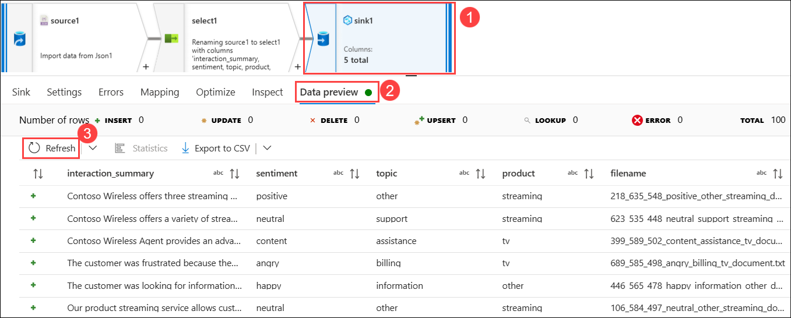

1. Once you're satisfied with the column mappings (ensure all 5 are present and formatted as strings), click **Publish all** at the top. In the confirmation panel that opens, click the blue **Publish** button to save your configuration.

      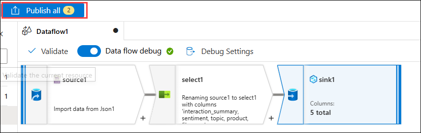

1. Your completed and saved data flow should resemble the structure shown below.

      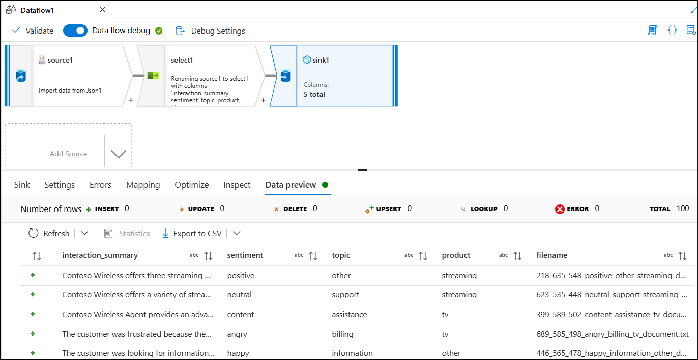

### E. Create Synapse Pipeline

1. After creating the **Data flow**, the next step is to configure a **Pipeline** to contain it. In Synapse Studio, go to the left-hand menu and select **Integrate (1)**. At the top of the page, click the **+ (2)** button and choose **Pipeline (3)** to create a new pipeline.

      

2. Next, we need to add a **Data flow** to our Pipeline. With your new **Pipeline tab (1)** open, go to the **Activities** section and search for `data` **(2)** and select **Data flow (3)** activity and **drag-and-drop (4)** it into your Pipeline.

      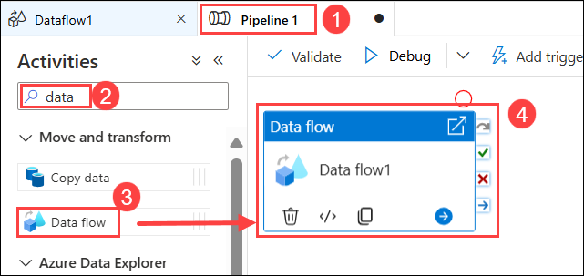

3. Under the **Settings (1)** tab of the **Data flow** activity, use the **Data flow (2)** dropdown to select the flow you created earlier. Expand the **Staging (3)** section and choose your linked service **openailinkedservice (4)**. Click **Test connection (5)** to verify. Then, specify the **Staging storage folder** as **workshop-data/Staging (6)**.

      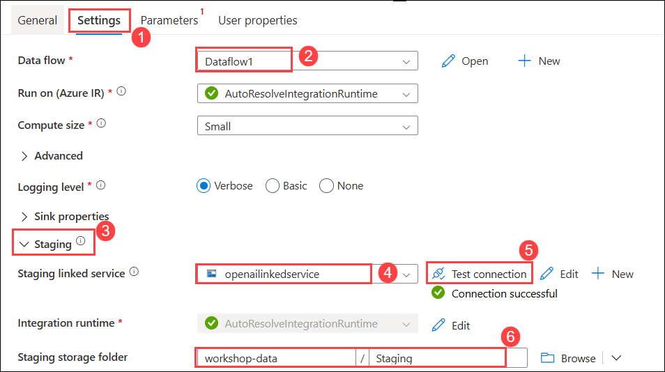

4. Click **Publish all** in the toolbar, and then confirm by selecting the **Publish** button at the bottom to save your pipeline configuration.

### F. Trigger Synapse Pipeline

1. Once the pipeline is published, you can trigger it by clicking the **Add trigger (1)** lightning bolt icon above the tabs. Select **Trigger now (2)** from the dropdown, then confirm the trigger in the popup by clicking **OK**.

      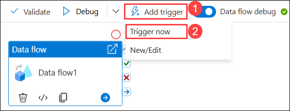
    
2. To monitor the pipeline run, navigate to the **Monitor (1)** section on the left. Under **Integration**, select **Pipeline runs (2)**. You’ll see the status of your pipeline execution under **Triggered (3)**, listed as **Pipeline 1 (4)**. The run typically completes in about 4 minutes.

      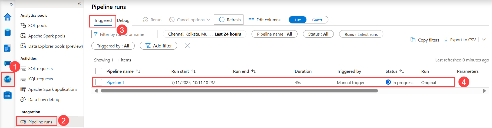

> **Congratulations** on completing the task! Now, it's time to validate it. Here are the steps:
> - If you receive a success message, you can proceed to the next task.
> - If not, carefully read the error message and retry the step, following the instructions in the lab guide. 
> - If you need any assistance, please contact us at cloudlabs-support@spektrasystems.com. We are available 24/7 to help you out.

<validation step="3e716f01-6da8-431e-aa81-4041b9054091" />

## Task 3: Query Results in Our SQL Table

1. First, confirm that your pipeline run has **Succeeded**.

      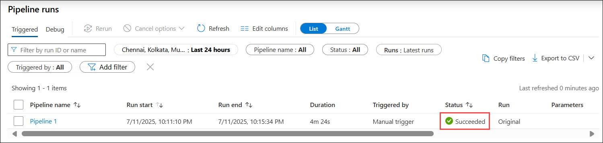

2. With the data now in the target SQL table, you can begin querying it or connecting it to Power BI for visualization. To explore the output, upload transcript files to the **generated\_documents** folder. You’ll observe new cleansed files appearing in the **cleansed\_documents** folder.

3. To run a query, open the **Develop (1)** tab and select the existing **SQL Script (2)**. Replace the existing code with the SQL below **(3)**. Choose **openaisql01 (4)** as the SQL pool and click **Run (5)**.

     ```SQL 
    SELECT sentiment, count(*) as "Sum of Sentiment"
    FROM [dbo].[cs_detail]
    GROUP BY sentiment
    ORDER BY count(*) desc     
     ```
    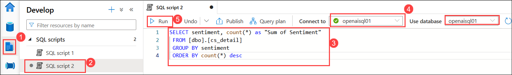
   
4. Once executed, the query will display the sentiment analysis results. If you're using the sample files, you should see output similar to the example below **(6)**.

    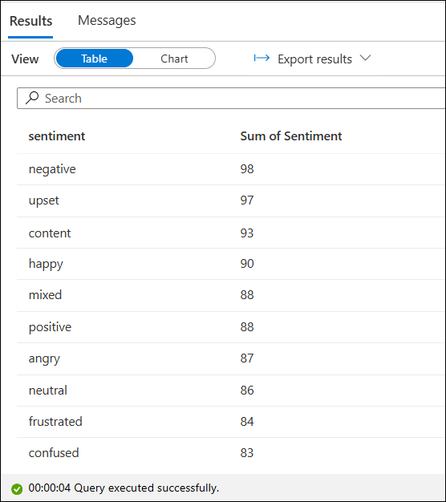         

## Summary

In this lab, you successfully ingested data into a storage account, created a Synapse workspace, built a pipeline and data flow, and queried the results within a SQL table.

### You have successfully completed the exercise. Click on **Next >>** to proceed with the next exercise.


