# Exercise 3: Build an Open AI application with Python

### Estimated Duration: 90 Minutes

In this Exercise, participants will develop an application using OpenAI's APIs and the Python programming language. The goal is to demonstrate how to implement AI functionalities such as language generation, sentiment analysis, or recommendation systems using Python, leveraging OpenAI's powerful models and tools.

1. Navigate back to the **Azure Portal**, search for **Azure Synapse Analytics (1)**, and select it **(2)** from the results.

     

2. In the **Azure Synapse Analytics** window, select **synapseworkspace<inject key="DeploymentID" enableCopy="false"/>**. 

1. On the **Overview** page of the Synapse workspace you created, click on **Open** under **Open Synapse Studio** to launch Azure Synapse Studio.
     
     .png)
    
1. In Synapse Studio, click on **Develop (1)**, then click **+ (2)** and select **Import (3)**.

    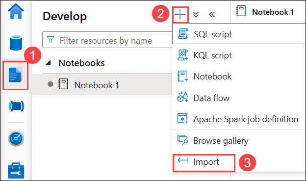

1. Navigate to the `C:\labfile\OpenAIWorkshop-main\scenarios\powerapp_and_python\python` location and select `OpenAI_notebook.ipynb`, then click on **Open**.

     

1. Click the **Collapse** icon to maximize the workspace.

    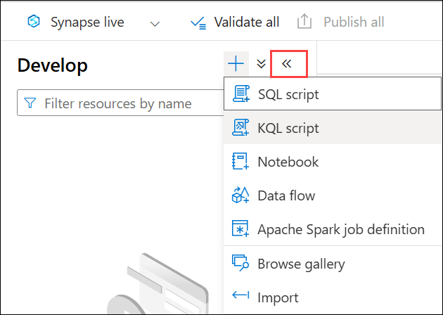

1. From the **Attach to** dropdown, select **openaisparkpool**.

    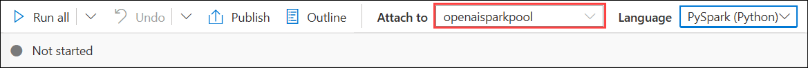

1. Run each notebook cell sequentially by clicking the **Run (▷)** button next to each, following the steps below.

1. Under **1. Install OpenAI**, click **Run** next to the first cell.

    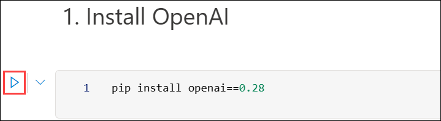

    > **Note**: If the **Install OpenAI** cell takes longer than expected and keeps looping, click on **Stop session**. Wait until the **Apache Spark pools** change to the **Stopped** state. You may need to restart the kernel to use the updated packages.
    
    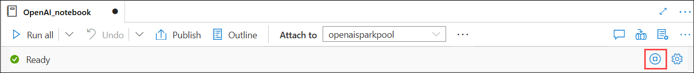

1. Under **2. Import helper libraries and instantiate credentials**, replace **AZURE_OPENAI_API_KEY** and **AZURE_OPENAI_ENDPOINT** with your API key and endpoint URL. Then, run this cell after updating the required values.

     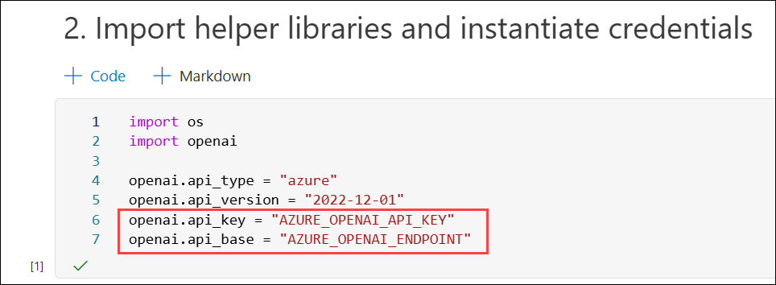
   
1. From the Azure Portal, go to the **openaicustom-<inject key="DeploymentID" enableCopy="false"/> (1)** resource group and select the **openai-<inject key="DeploymentID" enableCopy="false"/> (2)** Azure OpenAI resource.

    

1. Under Resource Management, select **Keys and Endpoint (1)** under **Resource Management** section, and click **Show Keys (2)**. Copy **Key 1 (3)** and **Endpoint (4)**, and replace the **AZURE_OPENAI_API_KEY** and **AZURE_OPENAI_ENDPOINT** with your API key and Endpoint URL in the script.

   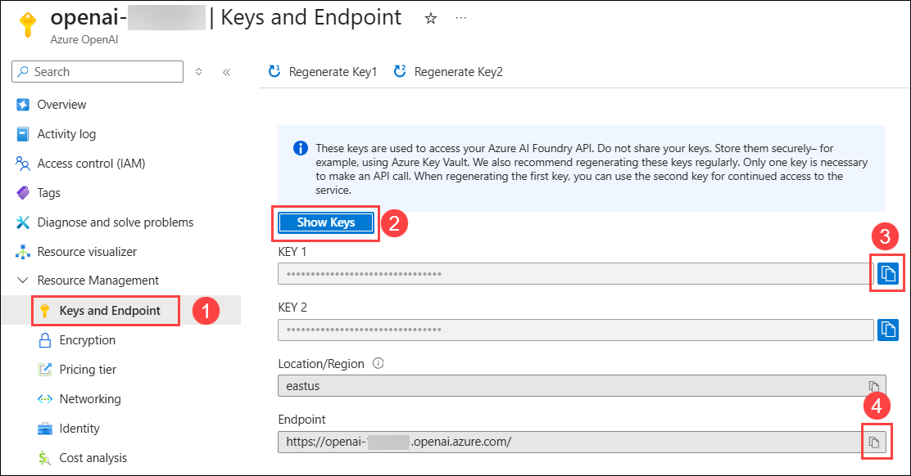
     
    > **Note:** If you come across the error "OpenAI module not found," please follow these steps:

     - Add an asterisk (`*`) next to `0.` to initiate the installation of the latest OpenAI module.

     - Run the "Install OpenAI" cell. Once the installation is complete, re-run the notebook.

          

1. For **2. Choose a Model**, replace the **model** value from **text-curie-001** to **demomodel** and **run** this cell.

    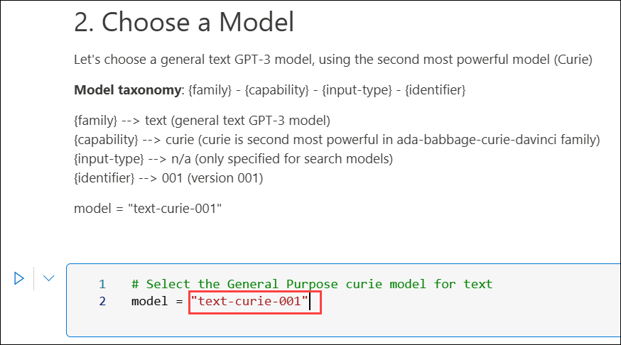

1. For the cell under **temperature**, replace the **engine** value from **text-curie-001** to **demomodel**, and run this cell.

     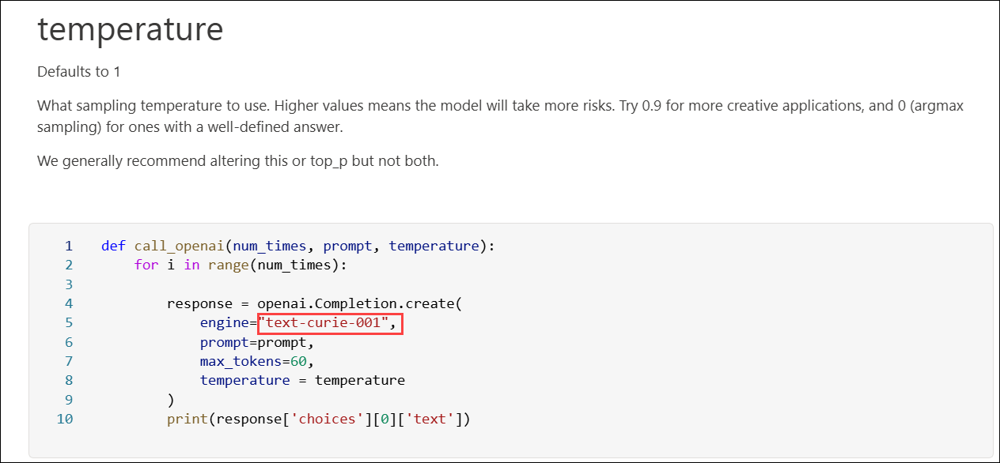

1. For the cell under **top_p**, replace the **engine** value from **text-curie-001** to **demomodel**, and run this cell.

     

1. For the cell under **n**, replace the **engine** value from **text-curie-001** to **demomodel**, and run this cell.

     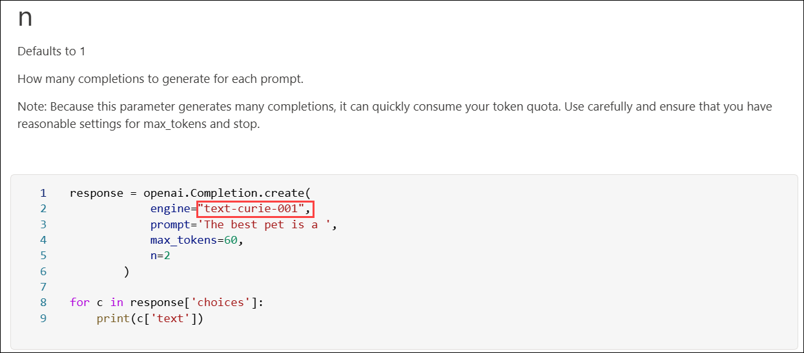

1. For the cell under **logprobs**, replace the **engine** value from **text-curie-001** to **demomodel**, and run this cell.

     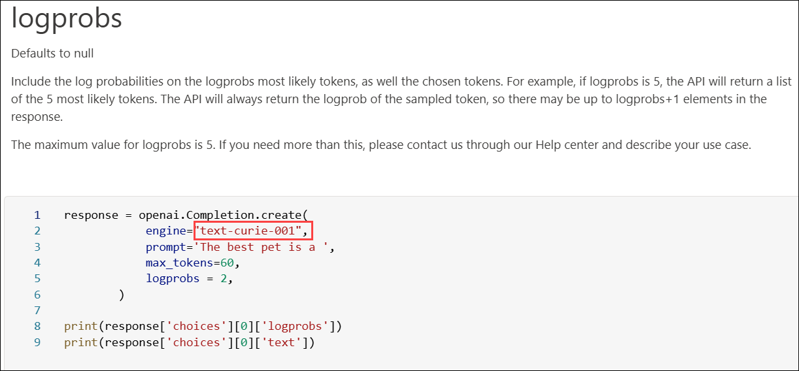

1. After successfully executing all cells, click **Publish all**.

     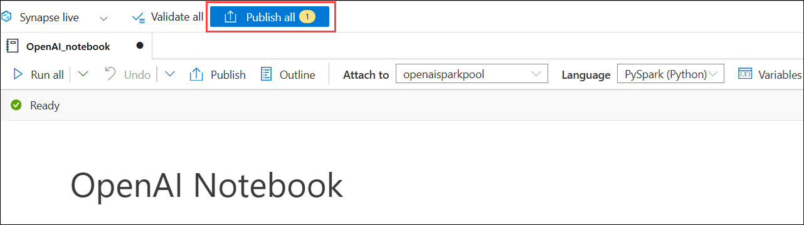

1. Finally, click **Publish** to save all changes.

    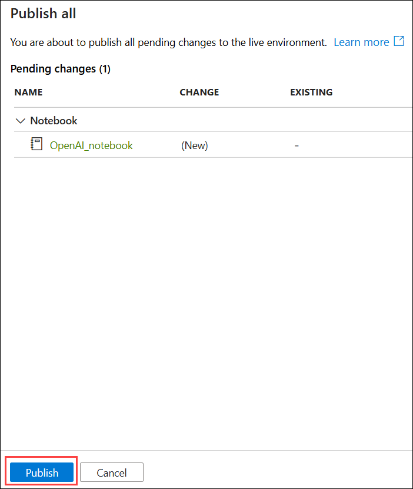

> **Congratulations** on completing the task! Now, it's time to validate it. Here are the steps:
> - If you receive a success message, you can proceed to the next task.
> - If not, carefully read the error message and retry the step, following the instructions in the lab guide. 
> - If you need any assistance, please contact us at Cloudlabs-support@spektrasystems.com. We are available 24/7 to help you out.

<validation step="f943c5b3-b07a-4779-bc2f-9e13ee01378a" />

## Summary

In this exercise, you created and ran a Python-based notebook inside Azure Synapse Studio, integrating it with OpenAI to demonstrate capabilities such as language generation and sentiment analysis.

### You have successfully completed the exercise. Click on **Next >>** to proceed with the next exercise.

