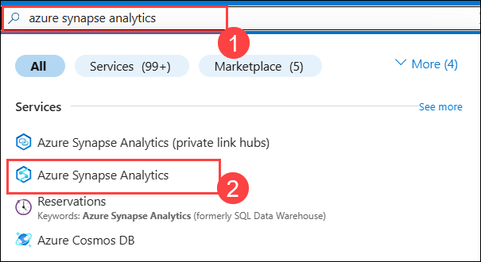
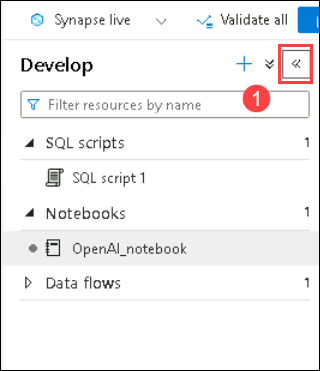
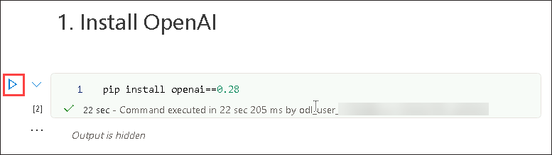

# Exercise 3: Build an Open AI application with Python

### Estimated Duration: 90 minutes

In this lab, participants will develop an application using OpenAI's APIs and Python programming language. The goal is to demonstrate how to implement AI functionalities such as language generation, sentiment analysis, or recommendation systems using Python, leveraging OpenAI's powerful models and tools.

1. Navigate back to the **Azure Portal**. Search **Azure Synapse Analytics (1)** and select **Azure Synapse Analytics (2)** in the Azure portal.

     

1. On **Azure Synapse Analytics** window select **synapseworkspace<inject key="DeploymentID" enableCopy="false"/>**.   

1. On the **Overview** blade under the **Getting started** section, click **Open** to open Synapse Studio.
     
     .png)
    
1. Click on **Develop (1)**, then click on **+ (2)**, and select **Import**.

    

1. Navigate to the `C:\labfile\OpenAIWorkshop-main\scenarios\powerapp_and_python\python` location and select `OpenAI_notebook.ipynb`, then click on **Open**.

     

1. Click the **Collapse** icon to maximize the screen.

    

1. Select **openaisparkpool** from the drop-down menu of **Attach to**.

    .png)

1. Click on the **▷ Run** button next to each cell, step-by-step, in the order mentioned below.

1. Under **1. Install OpenAI**, click on the **Run** button next to the first cell. 

    

    > **Note**: If the **Install OpenAI** cell takes longer than expected and keeps looping, click on **Stop session**. Wait until the **Apache Spark pools** change to the **Stopped** state. You may need to restart the kernel to use the updated packages.
      

1. Under **2. Import helper libraries and instantiate credentials**, replace **AZURE_OPENAI_API_KEY** and **AZURE_OPENAI_ENDPOINT** with your API key and endpoint URL. Then, run this cell after updating the required values.

     
   
1. From Azure Portal, navigate to the **openaicustom-<inject key="DeploymentID" enableCopy="false"/>** resource group, and select the **openai-<inject key="DeploymentID" enableCopy="false"/>** Azure OpenAI resource.

    

1. Under Resource Management, select **Keys and Endpoint (1)**, and click **Show Keys (2)**. Copy **Key 1 (3)** and **Endpoint (4)**, and replace the **AZURE_OPENAI_API_KEY** and **AZURE_OPENAI_ENDPOINT** with your API key and Endpoint URL in the script.

   
     
    > **Note:** If you come across the error "OpenAI module not found," please follow these steps:

     - Add * next to 0.* to initiate the installation of the latest OpenAI module.

     - Run the "Install OpenAI" cell. Once the installation is complete, re-run the notebook.

          

1. For **2. Choose a Model**, replace the **model** value from **text-curie-001** to **demomodel** and **run** this cell.

    

1. For the cell under **temperature**, replace the **engine** value from **text-curie-001** to **demomodel**, and run this cell.

     

1. For the cell under **top_p**, replace the **engine** value from **text-curie-001** to **demomodel**, and run this cell.

     

1. For the cell under **n**, replace the **engine** value from **text-curie-001** to **demomodel**, and run this cell.

     

1. For the cell under **logprobs**, replace the **engine** value from **text-curie-001** to **demomodel**, and run this cell.

     

1. After running the Notebook cells successfully, click on **Publish all**.

     

1. Then click on **Publish** to save the changes. 

    

> **Congratulations** on completing the task! Now, it's time to validate it. Here are the steps:
> - If you receive a success message, you can proceed to the next task.
> - If not, carefully read the error message and retry the step, following the instructions in the lab guide. 
> - If you need any assistance, please contact us at Cloudlabs-support@spektrasystems.com. We are available 24/7 to help you out.

<validation step="f943c5b3-b07a-4779-bc2f-9e13ee01378a" />

## Summary

In this lab, you have successfully developed an application by implementing AI functionalities such as language generation, sentiment analysis, or recommendation systems using Python, leveraging OpenAI's powerful models and tools.

### You have successfully completed the lab
