# Exercise 2: Build an Open AI application with Power App 

### Estimated Duration: 90 Minutes

This Exercise focuses on creating an application using OpenAI capabilities integrated with Microsoft Power Apps. Participants will learn how to build a functional application that leverages AI for tasks such as natural language understanding, data analysis, or customer interaction within the Power Apps framework.

1. Open a new tab and navigate to [Power Apps](https://make.powerapps.com/). On the **Welcome to Power Apps** page, select your **Country/Region (1)** and click **Get started (2)**.

   
    
2. Select **Apps (1)** on the left navigation pane, click on the **Import app (2)** dropdown, and select **From package (.zip) (3)**.

    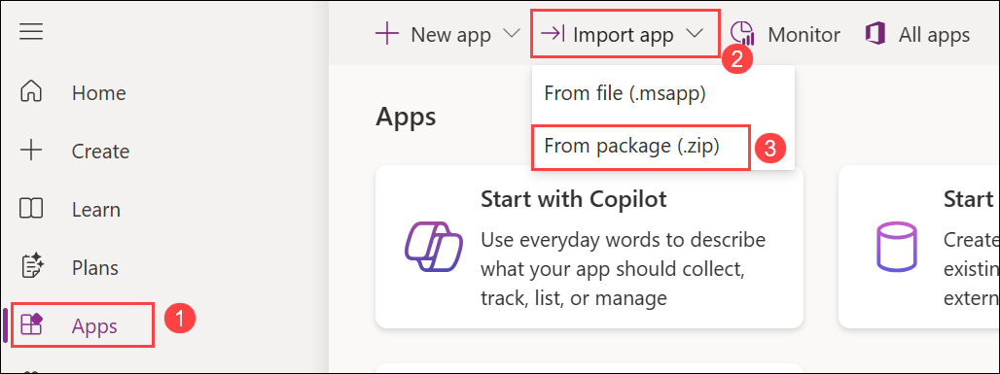

3. On the **Import package** page, click **Upload**.

    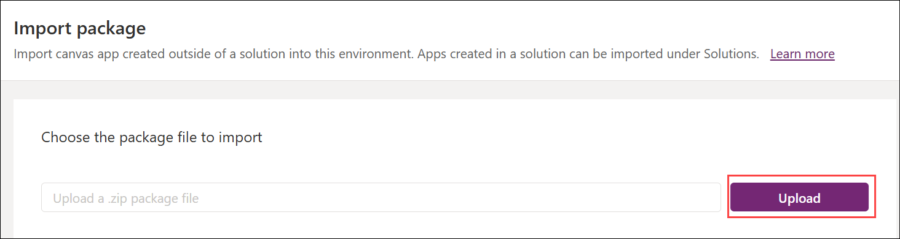

4. Navigate to `C:\labfile\OpenAIWorkshop-main\scenarios\powerapp_and_python\powerapp`, select the **OpenAI-Playground\_20230302010547 (1)** zip file, and click **Open (2)**.

     

5. Once the zip file is uploaded, under **Review Package Content** for **OpenAI Playground**, click the setup icon under **Action**.

     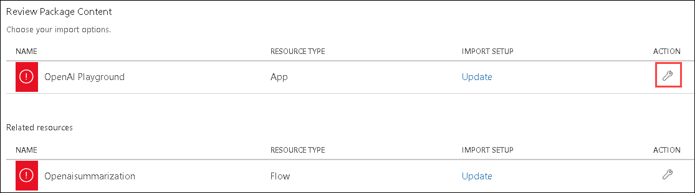

6. In the **Import setup** pane, choose **Create as new (1)** from the **Setup** dropdown and click **Save (2)**.

      

7. Repeat steps 5 and 6 for the **Openaisummarization** component.

8. Click on **Import** to bring the package into the PowerApps environment.

   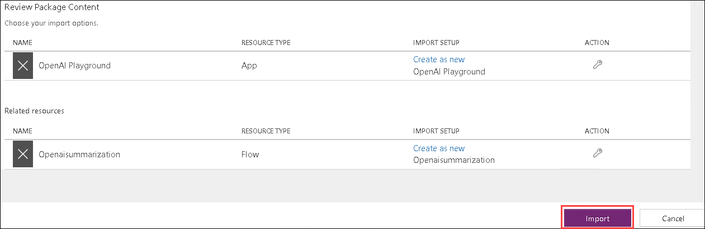

9. Once the import completes, go to **Apps (1)**, click on the `⋮ (2)` icon next to **OpenAI Playground**, and select **Edit (3)**.

   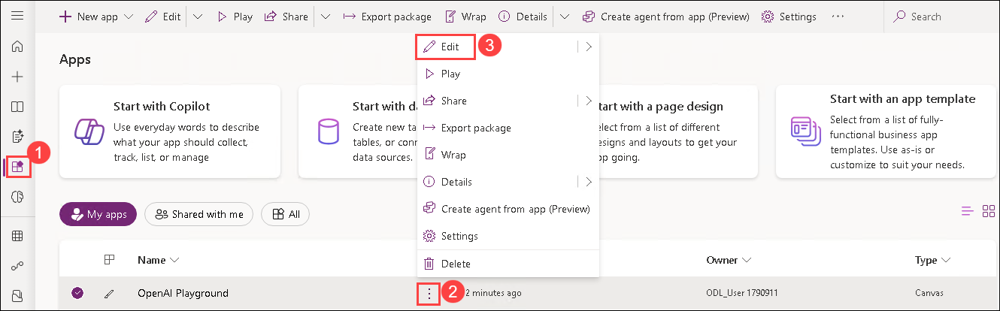 

   > **Note:** If **OpenAI Playground** is not visible, wait for 5 minutes and refresh the page.

11. You will observe that it has imported the Power App canvas app and the Power Automate Flow into the workspace.

      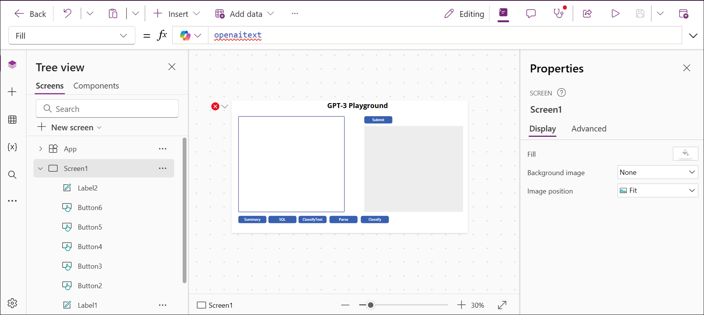

    > **Note:** If prompted with **Welcome to Power Apps Studio**, click **Skip**.

12. To navigate back, click on **Back (1)**, then click **Leave (2)**.

      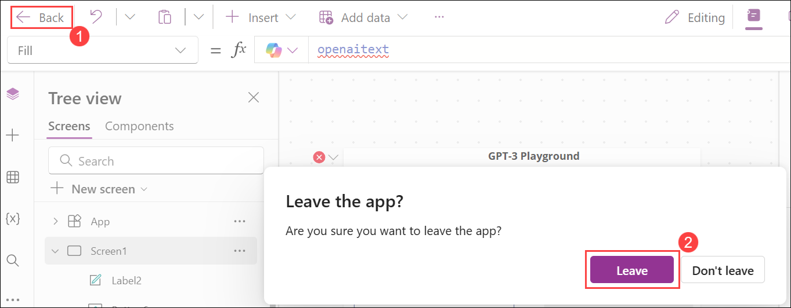

13. On the **Flows (1)** tab, select the radio button next to **Openaisummarization (2)**, then click on `... (3)` and choose **Turn on (4)**.

      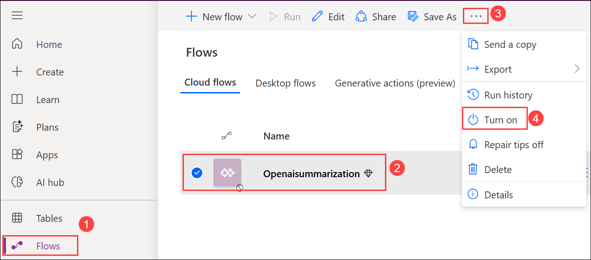

      >**Note:** If you encounter the **Welcome to Power Automate** prompt, click **Get started**.

14. Click **Edit** for the **Openaisummarization** flow.

      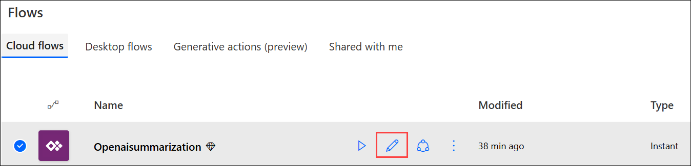

14. In the HTTP step of the flow, update the following:

    - Replace `https://your-resource-name.openai.azure.com/` with **<inject key="OpenAIEndpoint" enableCopy="true"/> (1)**
    - Replace `deployment-id` with **<inject key="openaimodulename" enableCopy="true"/> (2)**
    - Replace `api-version` with **2023-09-15-preview (3)**
    - Replace `YOUR_API_KEY` with **<inject key="OpenAIKey" enableCopy="true"/> (4)**
      Then, click **Save**.

      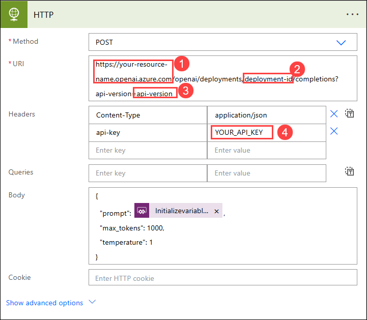
   
15. From the **Apps (1)** page, select the radio button next to the **OpenAI Playground** app and click the **Play (2)** button to run it.

     

16. If prompted to start a trial, click **Start a free trial**. On the **You need a Power Apps license to use this app** window, choose your region, then click **Start my trial** and wait 2-3 minutes.
    
17. In the canvas app, click the **Summary (1)** button, verify the **auto-filled text (2)**, then click **Submit (3)** to view the generated **Summary (4)**.

     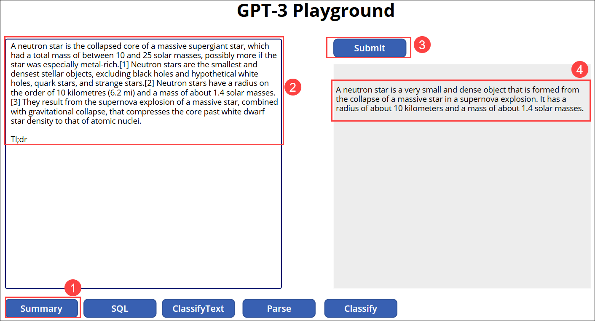

    > **Note:** You may also explore other available options like **SQL**, **ClassifyText**, **Parse**, and **Classify**.

## Summary

In this exercise, you successfully integrated OpenAI APIs with Power Apps to implement capabilities such as language processing, summarization, and intelligent automation using a Power App and Power Automate flow.

### You have successfully completed the exercise. Click on **Next >>** to proceed with the next exercise.

